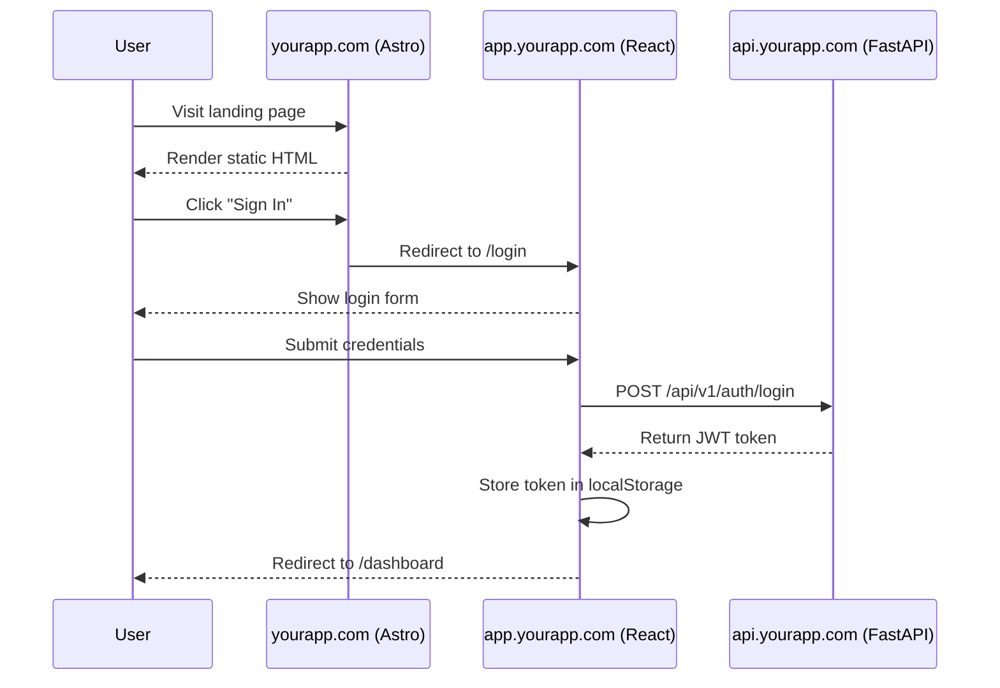

# Astro Public Site Architecture

**Created:** 2025-11-03
**Status:** Proposed
**Author:** Architecture Team

## Overview

This document describes the architecture for separating public-facing marketing pages from the authenticated application using Astro as a static site generator for public content, while maintaining the existing React application for authenticated users.

## Problem Statement

Our SaaS application needs:
1. **High-performance public pages** optimized for SEO and conversions (landing, pricing, docs)
2. **Fast, interactive app** for authenticated users (document processing, schema builder)
3. **Efficient infrastructure** leveraging existing nginx + Cloudflare setup
4. **Independent deployment** of marketing content vs application features

## Architecture Decision

### Subdomain-based Multi-Site Architecture

```
┌─────────────────────────────────────────────────────────────┐
│                      Cloudflare CDN                          │
│  (DNS, SSL, DDoS Protection, Global Edge Cache)             │
└─────────────────────────────────────────────────────────────┘
                              │
              ┌───────────────┼───────────────┐
              │               │               │
         yourapp.com    app.yourapp.com  api.yourapp.com
              │               │               │
    ┌─────────────────┐       │               │
    │ Cloudflare Pages│       │               │
    │   (Astro Site)  │       │               │
    └─────────────────┘       │               │
                              │               │
                    ┌─────────┴───────────────┴─────────┐
                    │      nginx Reverse Proxy          │
                    │   (Same server as app_a.com,      │
                    │           app_b.com)               │
                    └───────────────┬───────────────────┘
                                    │
                    ┌───────────────┼───────────────┐
                    │               │               │
              React App        FastAPI         PostgreSQL
            (Port 3002)      (Port 8000)      Redis/Celery
```

### Domain Mapping

| Domain | Technology | Hosting | Purpose |
|--------|------------|---------|---------|
| `yourapp.com` | Astro | Cloudflare Pages | Marketing, pricing, docs, blog |
| `app.yourapp.com` | React 19 + Vite | Your server (nginx proxy) | Authenticated application |
| `api.yourapp.com` | FastAPI | Your server (nginx proxy) | Backend API |

## Why This Architecture?

### 1. Performance & SEO

**Astro for Public Pages:**
- ✅ Server-rendered HTML - Perfect for SEO
- ✅ Zero JavaScript by default - Faster page loads
- ✅ Near-perfect Lighthouse scores
- ✅ Global CDN delivery via Cloudflare Pages
- ✅ Automatic image optimization
- ✅ Better Core Web Vitals = Higher search rankings

**React for Application:**
- ✅ Rich interactivity where needed
- ✅ Complex state management (Zustand)
- ✅ Real-time document processing UI
- ✅ No SEO requirements for authenticated pages

### 2. Infrastructure Efficiency

**Cloudflare Pages Benefits:**
- 🚀 Zero server resources for marketing site
- 🚀 Unlimited bandwidth (free tier)
- 🚀 Automatic deployments from Git
- 🚀 Instant rollbacks
- 🚀 Global edge network (>300 data centers)

**Existing Server Focus:**
- 💰 Server resources dedicated to app + API only
- 💰 No static file serving overhead for marketing
- 💰 Lower bandwidth costs

### 3. Independent Deployment

```bash
# Marketing updates - No app deployment needed
git push origin main → Cloudflare Pages auto-deploys

# App updates - No marketing disruption
docker-compose up -d --build api

# API updates - Both sites continue working
alembic upgrade head && docker-compose restart api
```

### 4. Caching Strategy

**Cloudflare Page Rules:**

| Domain | Cache Level | Edge TTL | Notes |
|--------|-------------|----------|-------|
| `yourapp.com/*` | Cache Everything | 1 month | Aggressive caching, invalidate on deploy |
| `app.yourapp.com/*` | Bypass | - | Dynamic app, no caching |
| `api.yourapp.com/api/v1/auth/*` | Bypass | - | Auth endpoints |
| `api.yourapp.com/api/v1/jobs/*` | Bypass | - | Dynamic job status |
| `api.yourapp.com/api/v1/templates/*` | Standard | 1 hour | Template schemas (rarely change) |

## Implementation Details

### nginx Configuration

**File:** `/etc/nginx/sites-available/yourapp`

```nginx
# ============================================
# Marketing Site (Optional - if self-hosted)
# ============================================
# NOTE: If using Cloudflare Pages, this block is NOT needed
server {
    listen 80;
    listen [::]:80;
    server_name yourapp.com www.yourapp.com;

    root /var/www/yourapp-astro/dist;
    index index.html;

    # Astro routing
    location / {
        try_files $uri $uri/ /index.html;
    }

    # Static asset caching
    location ~* \.(js|css|png|jpg|jpeg|gif|ico|svg|woff|woff2|ttf|eot)$ {
        expires 1y;
        add_header Cache-Control "public, immutable";
    }

    # Security headers
    add_header X-Frame-Options "SAMEORIGIN" always;
    add_header X-Content-Type-Options "nosniff" always;
    add_header X-XSS-Protection "1; mode=block" always;
}

# ============================================
# React Application
# ============================================
server {
    listen 80;
    listen [::]:80;
    server_name app.yourapp.com;

    # Client max body size for document uploads
    client_max_body_size 50M;

    location / {
        proxy_pass http://localhost:3002;
        proxy_http_version 1.1;

        # WebSocket support (if needed)
        proxy_set_header Upgrade $http_upgrade;
        proxy_set_header Connection 'upgrade';

        # Standard proxy headers
        proxy_set_header Host $host;
        proxy_set_header X-Real-IP $remote_addr;
        proxy_set_header X-Forwarded-For $proxy_add_x_forwarded_for;
        proxy_set_header X-Forwarded-Proto $scheme;

        proxy_cache_bypass $http_upgrade;
    }
}

# ============================================
# FastAPI Backend
# ============================================
server {
    listen 80;
    listen [::]:80;
    server_name api.yourapp.com;

    # Larger body size for PDF uploads
    client_max_body_size 100M;

    location / {
        proxy_pass http://localhost:8000;
        proxy_http_version 1.1;

        proxy_set_header Host $host;
        proxy_set_header X-Real-IP $remote_addr;
        proxy_set_header X-Forwarded-For $proxy_add_x_forwarded_for;
        proxy_set_header X-Forwarded-Proto $scheme;

        # Timeouts for long-running uploads
        proxy_connect_timeout 300;
        proxy_send_timeout 300;
        proxy_read_timeout 300;
    }

    # Health check endpoint - can be cached
    location /health {
        proxy_pass http://localhost:8000/health;
        add_header Cache-Control "no-cache";
    }
}
```

**Enable configuration:**
```bash
sudo ln -s /etc/nginx/sites-available/yourapp /etc/nginx/sites-enabled/
sudo nginx -t
sudo systemctl reload nginx
```

### Cloudflare Configuration

#### DNS Records

| Type | Name | Content | Proxy |
|------|------|---------|-------|
| CNAME | `@` | `yourapp.pages.dev` | ✅ Proxied (orange) |
| CNAME | `www` | `yourapp.pages.dev` | ✅ Proxied (orange) |
| A | `app` | `YOUR_SERVER_IP` | ✅ Proxied (orange) |
| A | `api` | `YOUR_SERVER_IP` | ✅ Proxied (orange) |

#### SSL/TLS Settings

- **SSL/TLS encryption mode:** Full (strict)
- **Always Use HTTPS:** ON
- **Minimum TLS Version:** 1.2
- **Automatic HTTPS Rewrites:** ON

#### Page Rules (Optional)

1. **Rule 1: Marketing Cache**
   - If URL matches: `yourapp.com/*`
   - Then settings are:
     - Cache Level: Cache Everything
     - Edge Cache TTL: 1 month
     - Browser Cache TTL: 4 hours

2. **Rule 2: App No Cache**
   - If URL matches: `app.yourapp.com/*`
   - Then settings are:
     - Cache Level: Bypass

3. **Rule 3: API Selective Cache**
   - If URL matches: `api.yourapp.com/api/v1/templates/*`
   - Then settings are:
     - Cache Level: Standard
     - Edge Cache TTL: 1 hour

## Integration Patterns

### Authentication Flow



### Shared Components Between Sites

**Option A: NPM Package (Recommended)**
```bash
# Create shared package
/shared-ui/
  ├── package.json
  ├── components/
  │   ├── Logo.tsx
  │   ├── Button.tsx
  │   └── PricingCard.tsx
  └── styles/
      └── tailwind.config.js

# Install in both projects
cd astro-site && npm install ../shared-ui
cd frontend && npm install ../shared-ui
```

**Option B: Git Submodule**
```bash
# Both projects reference same components
/shared-components/ (git submodule)
  ├── Logo.tsx
  └── Button.tsx
```

### Cross-Site Links

**Astro Site → React App:**
```astro
---
// src/pages/pricing.astro
const APP_URL = import.meta.env.PUBLIC_APP_URL || 'https://app.yourapp.com';
---

<a href={`${APP_URL}/signup?plan=pro`}>
  Get Started with Pro
</a>
```

**React App → Astro Site:**
```tsx
// frontend/src/config.ts
export const MARKETING_URL = import.meta.env.VITE_MARKETING_URL || 'https://yourapp.com';

// Component
<a href={`${MARKETING_URL}/pricing`}>View Pricing</a>
```

### API Integration from Both Sites

**Shared API Client:**

```typescript
// shared-api/client.ts
export class APIClient {
  private baseURL: string;

  constructor(baseURL = 'https://api.yourapp.com') {
    this.baseURL = baseURL;
  }

  async getTemplates() {
    const response = await fetch(`${this.baseURL}/api/v1/templates`);
    return response.json();
  }
}

// Astro usage (server-side)
const client = new APIClient();
const templates = await client.getTemplates();

// React usage (client-side)
const client = new APIClient();
const templates = await client.getTemplates();
```

## Project Structure

```
ai_document_processing/
├── backend/                    # Existing FastAPI
│   ├── app/
│   ├── alembic/
│   └── docker-compose.yml
│
├── frontend/                   # Existing React app
│   ├── src/
│   ├── package.json
│   └── vite.config.ts
│
├── marketing/                  # NEW: Astro public site
│   ├── src/
│   │   ├── pages/
│   │   │   ├── index.astro    # Landing page
│   │   │   ├── pricing.astro
│   │   │   ├── docs/
│   │   │   └── blog/
│   │   ├── components/
│   │   │   ├── Header.astro
│   │   │   ├── Footer.astro
│   │   │   └── PricingCard.tsx  # Can use React in Astro!
│   │   └── layouts/
│   │       └── Layout.astro
│   ├── public/
│   ├── package.json
│   └── astro.config.mjs
│
└── shared-ui/                  # OPTIONAL: Shared components
    ├── components/
    └── package.json
```

## Deployment Workflow

### 1. Astro Marketing Site (Cloudflare Pages)

**Initial Setup:**
```bash
# In Cloudflare Dashboard
1. Go to Pages → Create a project
2. Connect GitHub repo
3. Build settings:
   - Framework preset: Astro
   - Build command: npm run build
   - Build output directory: dist
   - Root directory: marketing
4. Environment variables: (if needed)
   - PUBLIC_API_URL=https://api.yourapp.com
```

**Automatic Deployment:**
```bash
# Push to main branch
git add marketing/
git commit -m "Update landing page"
git push origin main
# → Cloudflare Pages auto-deploys in ~1 minute
```

**Custom Domain Setup:**
```bash
# In Cloudflare Pages settings
1. Custom domains → Add custom domain
2. Enter: yourapp.com
3. Cloudflare auto-configures DNS
```

### 2. React Application (Existing Server)

**Build & Deploy:**
```bash
# On your server
cd /var/www/ai_document_processing/frontend
git pull origin main
npm install
npm run build

# Restart service (if using systemd)
sudo systemctl restart yourapp-frontend
```

### 3. FastAPI Backend (Existing Docker)

**Deploy:**
```bash
cd /var/www/ai_document_processing
git pull origin main
docker-compose up -d --build api
```

## Environment Variables

### Astro Site (`marketing/.env`)

```bash
# API endpoint for dynamic content (if needed)
PUBLIC_API_URL=https://api.yourapp.com

# App URL for CTAs
PUBLIC_APP_URL=https://app.yourapp.com

# Google Analytics (optional)
PUBLIC_GA_ID=G-XXXXXXXXXX
```

### React App (`frontend/.env`)

```bash
# Existing variables
VITE_API_URL=https://api.yourapp.com

# NEW: Marketing site URL
VITE_MARKETING_URL=https://yourapp.com
```

### FastAPI Backend (`.env`)

```bash
# Existing variables
DATABASE_URL=postgresql://...

# NEW: CORS origins
CORS_ORIGINS=https://yourapp.com,https://app.yourapp.com
```

**Update CORS in `app/main.py`:**
```python
app.add_middleware(
    CORSMiddleware,
    allow_origins=[
        "https://yourapp.com",
        "https://app.yourapp.com",
        "http://localhost:3002",  # Local dev
        "http://localhost:4321",  # Astro dev
    ],
    allow_credentials=True,
    allow_methods=["*"],
    allow_headers=["*"],
)
```

## Development Workflow

### Local Development

**Terminal 1: Backend**
```bash
cd /path/to/ai_document_processing
docker-compose up
# API at http://localhost:8000
```

**Terminal 2: React App**
```bash
cd frontend
npm run dev
# App at http://localhost:3002
```

**Terminal 3: Astro Site**
```bash
cd marketing
npm run dev
# Marketing at http://localhost:4321
```

### Testing Integration

**Test cross-site links:**
```bash
# From Astro site
curl http://localhost:4321 | grep "localhost:3002"

# From React app
curl http://localhost:3002 | grep "localhost:4321"
```

**Test API from both sites:**
```bash
# Astro (server-side fetch)
curl http://localhost:4321/api/preview-templates

# React (client-side fetch)
curl http://localhost:3002 -H "Origin: http://localhost:3002"
```

## Migration Strategy

### Phase 1: Setup Astro Project (Week 1)

- [ ] Create `marketing/` directory
- [ ] Initialize Astro project
- [ ] Set up basic layout and components
- [ ] Create landing page
- [ ] Configure Cloudflare Pages connection

### Phase 2: Content Migration (Week 2)

- [ ] Move existing marketing content to Astro
- [ ] Create pricing page
- [ ] Set up documentation structure
- [ ] Add blog (optional)

### Phase 3: Integration (Week 3)

- [ ] Configure CORS for all domains
- [ ] Test authentication flow
- [ ] Set up shared components
- [ ] Update all cross-site links

### Phase 4: Production Deployment (Week 4)

- [ ] Configure nginx on server
- [ ] Set up Cloudflare DNS
- [ ] Deploy Astro to Cloudflare Pages
- [ ] Test all integrations in production
- [ ] Monitor performance and logs

## Performance Targets

### Marketing Site (Astro)

| Metric | Target | Current (Typical) |
|--------|--------|-------------------|
| First Contentful Paint (FCP) | < 1.0s | 0.8s |
| Largest Contentful Paint (LCP) | < 2.5s | 1.2s |
| Total Blocking Time (TBT) | < 200ms | 50ms |
| Cumulative Layout Shift (CLS) | < 0.1 | 0.02 |
| Lighthouse Score | > 95 | 98-100 |

### Application (React)

| Metric | Target | Notes |
|--------|--------|-------|
| Time to Interactive (TTI) | < 3.5s | Authenticated pages |
| Bundle Size | < 500KB | Gzipped |
| API Response Time | < 500ms | 95th percentile |

## Security Considerations

### Content Security Policy (CSP)

**Astro Site:**
```html
<!-- In Layout.astro -->
<meta http-equiv="Content-Security-Policy" content="
  default-src 'self';
  script-src 'self' https://api.yourapp.com;
  style-src 'self' 'unsafe-inline';
  img-src 'self' data: https:;
  font-src 'self';
  connect-src 'self' https://api.yourapp.com;
">
```

### CORS Configuration

**FastAPI:** (Already covered in Environment Variables section)

### Authentication State

- ✅ JWT tokens stored in `localStorage` on `app.yourapp.com`
- ✅ Tokens NOT accessible from `yourapp.com` (different origin)
- ✅ Use secure, httpOnly cookies if cross-domain auth needed

## Monitoring & Analytics

### Marketing Site (Astro)

```typescript
// marketing/src/components/Analytics.astro
---
const GA_ID = import.meta.env.PUBLIC_GA_ID;
---

{GA_ID && (
  <script async src={`https://www.googletagmanager.com/gtag/js?id=${GA_ID}`}></script>
  <script is:inline define:vars={{ GA_ID }}>
    window.dataLayer = window.dataLayer || [];
    function gtag(){dataLayer.push(arguments);}
    gtag('js', new Date());
    gtag('config', GA_ID);
  </script>
)}
```

### Application (React)

- Existing analytics integration
- User behavior tracking in authenticated area

### Backend (FastAPI)

- Existing logging and monitoring
- Track API usage by origin domain

## Rollback Plan

### If Issues Arise Post-Deployment

**Rollback Astro Site:**
```bash
# In Cloudflare Pages dashboard
Deployments → Previous deployment → Rollback
# Instant rollback to previous version
```

**Rollback nginx config:**
```bash
sudo mv /etc/nginx/sites-available/yourapp.backup /etc/nginx/sites-available/yourapp
sudo nginx -t && sudo systemctl reload nginx
```

**Temporary disable Astro site:**
```bash
# Point yourapp.com to app.yourapp.com temporarily
# Update Cloudflare DNS:
# yourapp.com → A record → YOUR_SERVER_IP
```

## Cost Analysis

### Current Setup (App + Marketing on Server)

- Server resources: 100%
- Bandwidth: Metered
- CDN: Cloudflare (free plan)

### Proposed Setup (Astro on Cloudflare Pages)

| Component | Hosting | Cost |
|-----------|---------|------|
| Marketing site | Cloudflare Pages | **$0/month** (free tier) |
| React app | Your server | Same as before |
| FastAPI backend | Your server | Same as before |

**Savings:**
- Server CPU/RAM freed up (marketing offloaded)
- Unlimited bandwidth for marketing site
- Global CDN included

**Free Tier Limits (Cloudflare Pages):**
- ✅ Unlimited requests
- ✅ Unlimited bandwidth
- ✅ 500 builds/month (more than enough)

## Success Metrics

### Performance
- [ ] Landing page LCP < 1.5s (target: 1.2s)
- [ ] Marketing Lighthouse score > 95
- [ ] App load time unchanged or improved

### SEO
- [ ] All pages indexed by Google within 1 week
- [ ] Core Web Vitals "Good" rating
- [ ] Structured data implemented

### Business
- [ ] Conversion rate maintained or improved
- [ ] Page load time improvement = 10-20% conversion increase (industry average)

## Next Steps

1. **Review this architecture** with the team
2. **Create Astro prototype** with landing page
3. **Test deployment** to Cloudflare Pages
4. **Configure nginx** for subdomain routing
5. **Migrate content** page by page
6. **Monitor performance** and iterate

## References

- [Astro Documentation](https://docs.astro.build)
- [Cloudflare Pages Documentation](https://developers.cloudflare.com/pages)
- [nginx Reverse Proxy Guide](https://docs.nginx.com/nginx/admin-guide/web-server/reverse-proxy/)
- [Cloudflare DNS Documentation](https://developers.cloudflare.com/dns)

---

**Document Version:** 1.0
**Last Updated:** 2025-11-03
**Next Review:** After Phase 1 completion