# Conductor Integration - Visual Diagrams

**Date:** 2025-11-15
**Purpose:** Visual reference for system architecture and data flows

This document contains Mermaid diagrams for the Conductor integration architecture. These diagrams provide visual clarity to complement the written specifications.

---

## 1. High-Level System Architecture

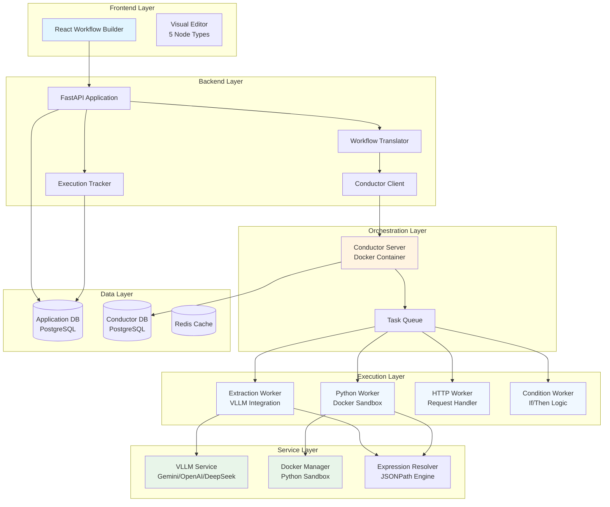

---

## 2. Full Workflow Execution Flow

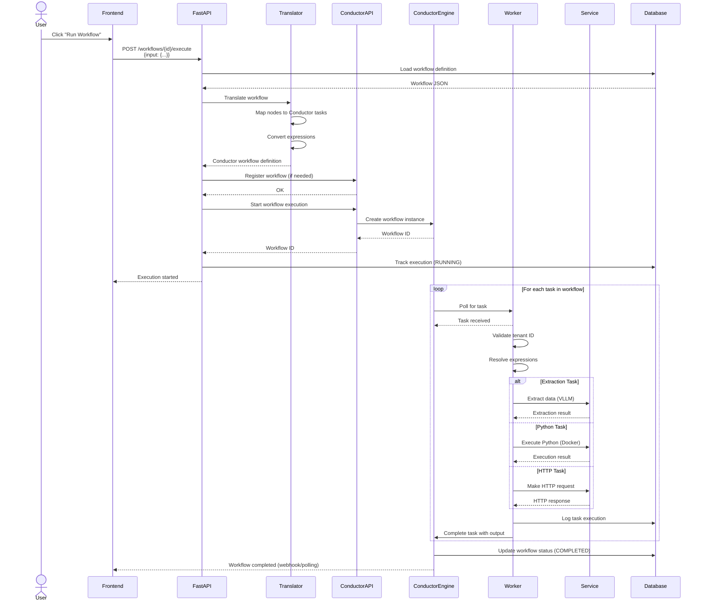

---

## 3. Isolated Node Testing Flow

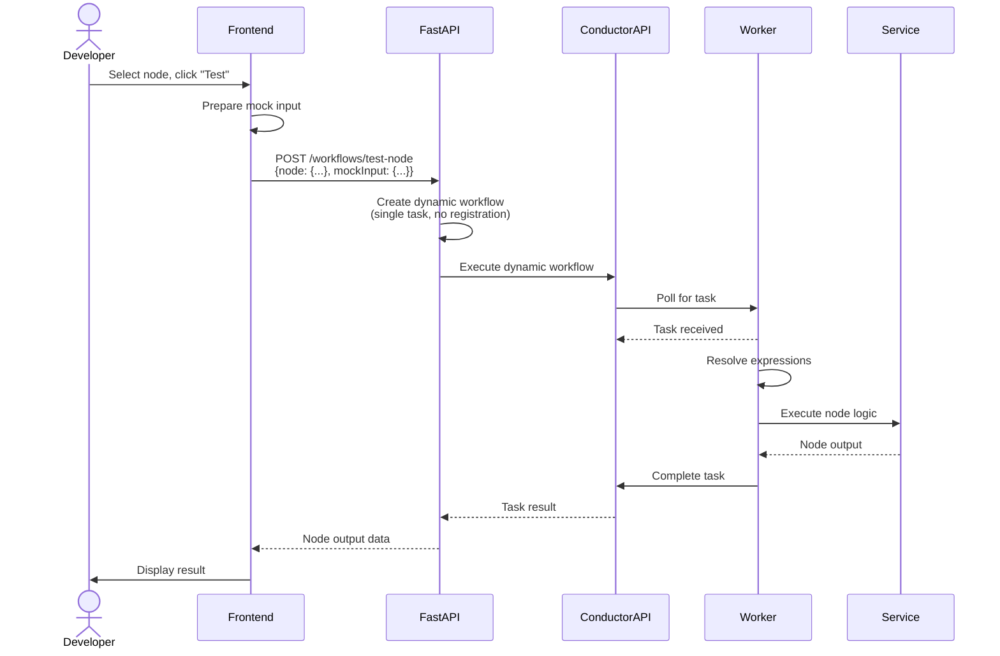

---

## 4. Frontend to Conductor Translation

```mermaid
graph LR
    subgraph "Frontend Workflow JSON"
        F_NODES[Nodes Array<br/>- HttpTrigger<br/>- Extraction<br/>- Python<br/>- HTTP<br/>- If]
        F_EDGES[Edges Array<br/>source → target]
        F_EXPR[Expressions<br/>{{$('Node').data.field}}]
    end

    subgraph "Translator Process"
        T1[Parse nodes & edges]
        T2[Build task sequence]
        T3[Map node types to<br/>Conductor tasks]
        T4[Convert expressions<br/>to Conductor format]
        T5[Generate workflow def]
    end

    subgraph "Conductor Workflow Definition"
        C_TASKS[Tasks Array<br/>- SIMPLE tasks<br/>- SWITCH tasks]
        C_INPUT[Input Parameters]
        C_OUTPUT[Output Parameters]
        C_EXPR[Conductor Expressions<br/>$&#123;task.output.field&#125;]
    end

    F_NODES --> T1
    F_EDGES --> T1
    F_EXPR --> T4

    T1 --> T2
    T2 --> T3
    T3 --> T4
    T4 --> T5

    T5 --> C_TASKS
    T5 --> C_INPUT
    T5 --> C_OUTPUT
    T4 --> C_EXPR

    style F_NODES fill:#e1f5ff
    style C_TASKS fill:#fff4e1
```

---

## 5. Worker Architecture

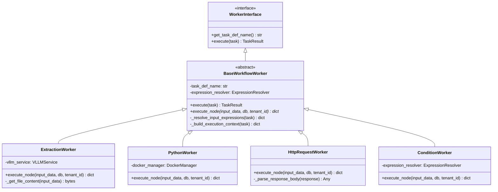

---

## 6. Docker Sandbox Security Architecture

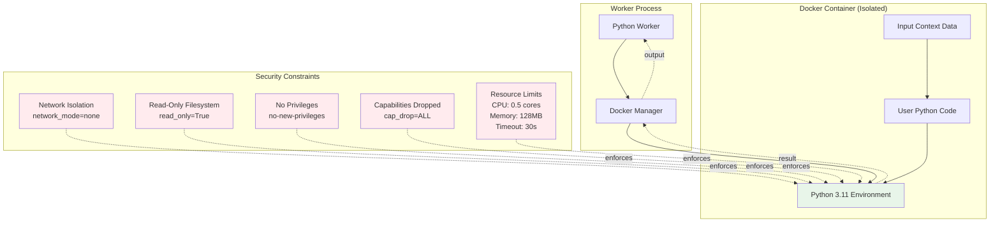

---

## 7. Expression Resolution Process

```mermaid
graph LR
    subgraph "Input Data"
        RAW[Node Config with Expressions<br/>prompt: '{{$('trigger').data.text}}'<br/>url: '{{$('extract').data.callback}}']
    end

    subgraph "Expression Resolver"
        PARSE[Parse Expression<br/>Regex: {{$("Node").data.field}}]
        EXTRACT[Extract Node Name & Path<br/>Node: 'trigger'<br/>Path: 'data.text']
        LOOKUP[Lookup in Context<br/>context['trigger']['data']['text']]
        JSONPATH[JSONPath Evaluation<br/>$.data.text]
        RESOLVE[Resolve Value<br/>'Extract invoice data']
    end

    subgraph "Execution Context"
        CTX[{<br/>  trigger: {data: {text: 'Extract invoice data'}},<br/>  extract: {data: {callback: 'https://...'}}<br/>}]
    end

    subgraph "Output Data"
        RESOLVED[Resolved Config<br/>prompt: 'Extract invoice data'<br/>url: 'https://...']
    end

    RAW --> PARSE
    PARSE --> EXTRACT
    EXTRACT --> LOOKUP
    LOOKUP --> CTX
    CTX --> JSONPATH
    JSONPATH --> RESOLVE
    RESOLVE --> RESOLVED

    style RAW fill:#e1f5ff
    style RESOLVED fill:#e8f5e9
```

---

## 8. Error Handling Hierarchy

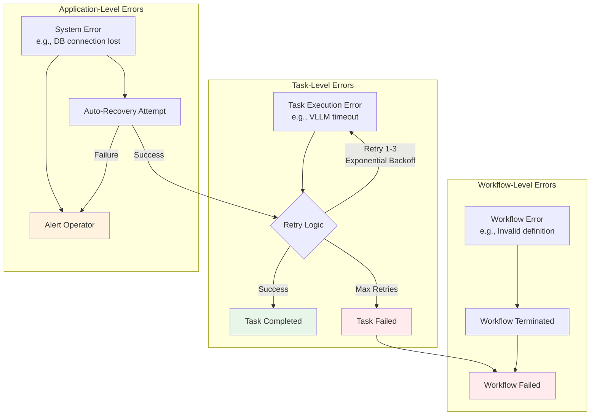

---

## 9. Data Flow: Extraction Node Example

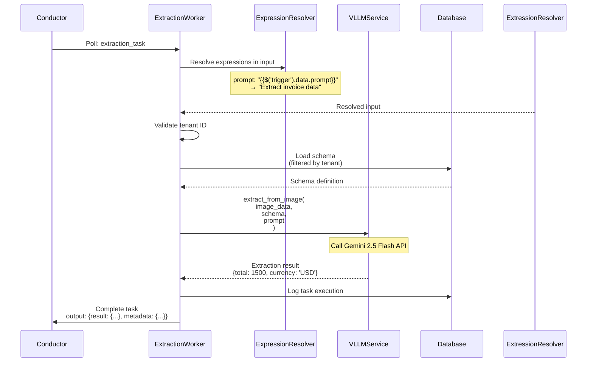

---

## 10. Component Directory Structure

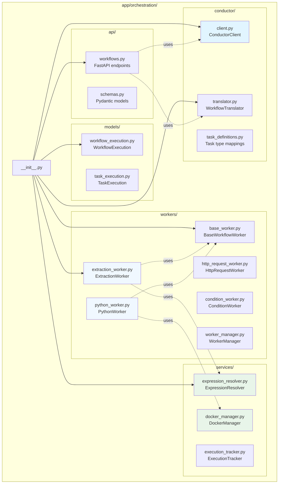

---

## 11. Deployment Architecture

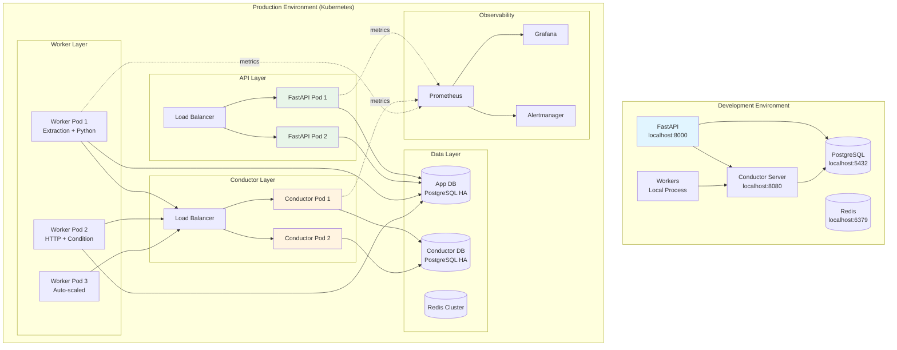

---

## 12. Node Type to Task Type Mapping

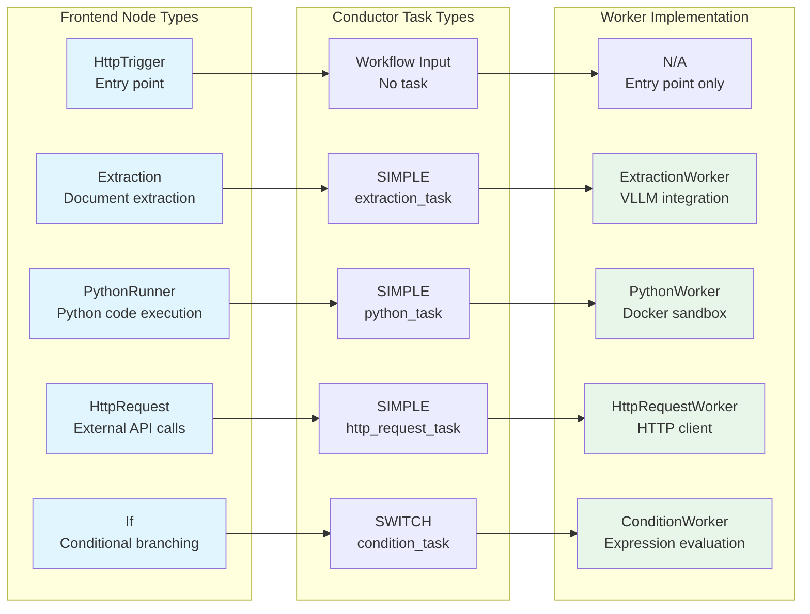

---

## 13. Tenant Isolation Flow

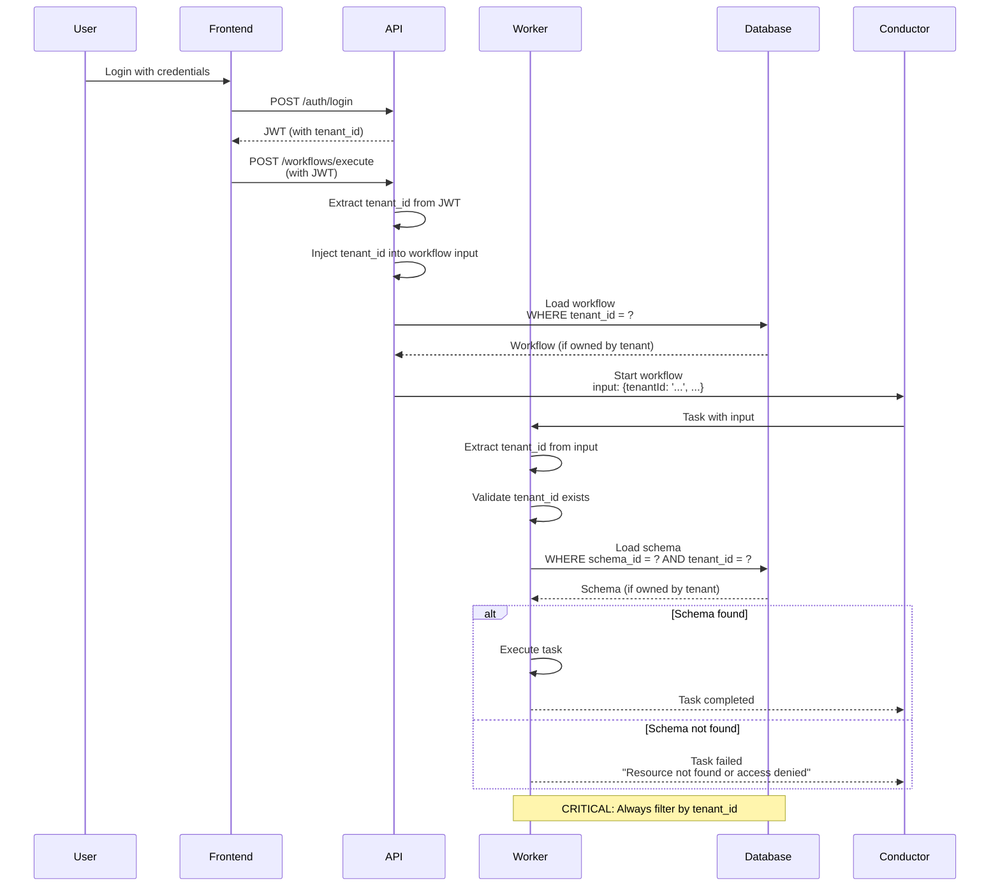

---

## Diagram Usage Guide

### For Presentations
- **Diagram 1:** High-level system architecture
- **Diagram 11:** Deployment architecture
- **Diagram 8:** Error handling hierarchy

### For Implementation
- **Diagram 5:** Worker class structure
- **Diagram 10:** Directory structure
- **Diagram 12:** Node type mappings

### For Security Review
- **Diagram 6:** Docker sandbox security
- **Diagram 13:** Tenant isolation flow

### For Debugging
- **Diagram 2:** Full workflow execution flow
- **Diagram 9:** Extraction node example
- **Diagram 7:** Expression resolution

---

**Last Updated:** 2025-11-15
**Version:** 1.0
**Related Documents:**
- Full Architecture: `2025-11-15-conductor-integration-architecture.md`
- Quick Start: `../../guides/2025-11-15-conductor-quick-start.md`
- Technical Decisions: `2025-11-15-conductor-key-decisions.md`
