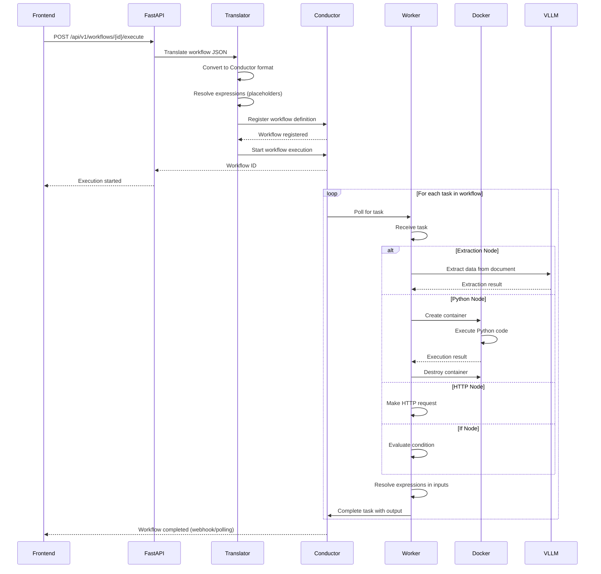
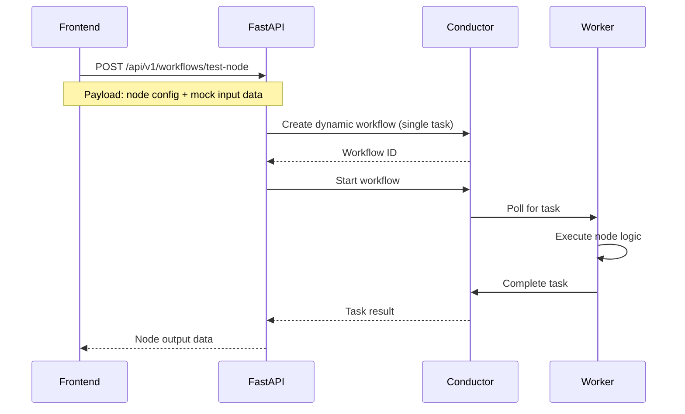

# Netflix Conductor Integration Architecture

**Date:** 2025-11-15
**Status:** Design Specification
**Version:** 1.0

## Executive Summary

This document specifies the architecture for integrating Netflix Conductor orchestration engine into the AI Document Processing platform to execute visual workflows created in the frontend workflow builder. The integration translates frontend workflow JSON into Conductor workflow definitions and executes nodes as distributed, stateless tasks.

**Key Design Decisions:**
- Use official Netflix Conductor Python SDK (`conductor-python`)
- Separate Conductor server deployment (Docker container)
- Backend-side expression resolution for security
- Docker sandbox for Python code execution
- Support two execution modes: isolated node testing and full workflow execution
- Leverage existing Celery/Redis infrastructure for task coordination

---

## Table of Contents

1. [System Overview](#system-overview)
2. [Architecture Design](#architecture-design)
3. [Directory Structure](#directory-structure)
4. [Frontend to Conductor Translation](#frontend-to-conductor-translation)
5. [Worker Implementation](#worker-implementation)
6. [Expression Resolution](#expression-resolution)
7. [Execution Modes](#execution-modes)
8. [Docker Sandbox for Python](#docker-sandbox-for-python)
9. [Integration Points](#integration-points)
10. [Deployment Strategy](#deployment-strategy)
11. [Error Handling & Retry](#error-handling--retry)
12. [Monitoring & Observability](#monitoring--observability)
13. [Security Considerations](#security-considerations)
14. [Implementation Roadmap](#implementation-roadmap)

---

## 1. System Overview

### 1.1 Current Architecture

```
┌─────────────────────────────────────────────────────────────┐
│                     Frontend (React)                        │
│  ┌───────────────────────────────────────────────────────┐ │
│  │  Visual Workflow Builder (ReactFlow)                   │ │
│  │  - HttpTrigger, Extraction, PythonRunner,             │ │
│  │    HttpRequest, If nodes                              │ │
│  │  - Expression system: {{$("Node").data.field}}        │ │
│  └───────────────────────────────────────────────────────┘ │
└─────────────────────────────────────────────────────────────┘
                              │
                              │ Saves workflow JSON
                              ▼
┌─────────────────────────────────────────────────────────────┐
│                    Backend (FastAPI)                        │
│  ┌───────────────────────────────────────────────────────┐ │
│  │  Existing Services:                                    │ │
│  │  - VLLM Service (Gemini/OpenAI/DeepSeek)              │ │
│  │  - Storage Service (Local/S3)                         │ │
│  │  - Credit Service                                     │ │
│  │  - Celery + Redis (Task Queue)                        │ │
│  └───────────────────────────────────────────────────────┘ │
└─────────────────────────────────────────────────────────────┘
```

### 1.2 Target Architecture with Conductor

```
┌─────────────────────────────────────────────────────────────────────┐
│                        Frontend (React)                             │
│  ┌───────────────────────────────────────────────────────────────┐ │
│  │  Visual Workflow Builder                                       │ │
│  │  - Create workflows visually                                  │ │
│  │  - Save workflow JSON                                          │ │
│  │  - Trigger execution (test node / full workflow)              │ │
│  └───────────────────────────────────────────────────────────────┘ │
└─────────────────────────────────────────────────────────────────────┘
                                  │
                                  │ POST /api/v1/workflows
                                  │ POST /api/v1/workflows/{id}/execute
                                  │ POST /api/v1/workflows/test-node
                                  ▼
┌─────────────────────────────────────────────────────────────────────┐
│                       Backend (FastAPI)                             │
│  ┌───────────────────────────────────────────────────────────────┐ │
│  │  NEW: app/orchestration/                                       │ │
│  │  ┌─────────────────────────────────────────────────────────┐  │ │
│  │  │  conductor/                                              │  │ │
│  │  │  - client.py          # Conductor API client wrapper     │  │ │
│  │  │  - translator.py      # JSON → Conductor workflow        │  │ │
│  │  │  - task_definitions.py # Task type definitions           │  │ │
│  │  └─────────────────────────────────────────────────────────┘  │ │
│  │  ┌─────────────────────────────────────────────────────────┐  │ │
│  │  │  workers/                                                │  │ │
│  │  │  - base_worker.py          # Abstract base worker        │  │ │
│  │  │  - extraction_worker.py    # VLLM document extraction    │  │ │
│  │  │  - python_worker.py        # Docker sandbox execution    │  │ │
│  │  │  - http_request_worker.py  # HTTP calls                  │  │ │
│  │  │  - condition_worker.py     # If/condition evaluation     │  │ │
│  │  └─────────────────────────────────────────────────────────┘  │ │
│  │  ┌─────────────────────────────────────────────────────────┐  │ │
│  │  │  services/                                               │  │ │
│  │  │  - expression_resolver.py  # Expression evaluation       │  │ │
│  │  │  - execution_tracker.py    # Track execution state       │  │ │
│  │  │  - docker_manager.py       # Docker container mgmt       │  │ │
│  │  └─────────────────────────────────────────────────────────┘  │ │
│  └───────────────────────────────────────────────────────────────┘ │
│                                                                     │
│  Existing Services:                                                 │
│  - VLLM, Storage, Credits (unchanged)                              │
└─────────────────────────────────────────────────────────────────────┘
                                  │
                                  │ Workflow execution
                                  ▼
┌─────────────────────────────────────────────────────────────────────┐
│                   Conductor Server (Docker)                         │
│  - Workflow orchestration engine                                    │
│  - Task scheduling and distribution                                 │
│  - State persistence (PostgreSQL)                                   │
│  - Metrics and monitoring                                           │
└─────────────────────────────────────────────────────────────────────┘
                                  │
                                  │ Task polling
                                  ▼
┌─────────────────────────────────────────────────────────────────────┐
│                    Worker Processes                                 │
│  - Poll Conductor for tasks                                         │
│  - Execute node logic                                               │
│  - Report results back to Conductor                                 │
└─────────────────────────────────────────────────────────────────────┘
                                  │
                                  │ Python execution
                                  ▼
┌─────────────────────────────────────────────────────────────────────┐
│               Docker Containers (Python Sandbox)                    │
│  - Isolated Python code execution                                   │
│  - Resource limits (CPU, memory, timeout)                           │
│  - Network isolation                                                │
└─────────────────────────────────────────────────────────────────────┘
```

---

## 2. Architecture Design

### 2.1 Component Overview

| Component | Responsibility | Technology |
|-----------|---------------|------------|
| **Conductor Server** | Workflow orchestration, task scheduling, state persistence | Netflix Conductor (Docker) |
| **Conductor Client** | API wrapper for workflow registration and execution | conductor-python SDK |
| **Translator** | Convert frontend JSON to Conductor workflow definitions | Python |
| **Workers** | Execute workflow nodes as distributed tasks | conductor-python TaskHandler |
| **Expression Resolver** | Evaluate `{{$("Node").data.field}}` expressions | Python JSONPath |
| **Docker Manager** | Manage Python sandbox containers | docker-py |
| **Execution Tracker** | Track workflow execution state in PostgreSQL | SQLAlchemy |

### 2.2 Data Flow: Full Workflow Execution



### 2.3 Data Flow: Isolated Node Testing



---

## 3. Directory Structure

### 3.1 Complete File Organization

```
app/orchestration/
├── __init__.py
├── conductor/
│   ├── __init__.py
│   ├── client.py                 # ConductorClient wrapper
│   ├── translator.py             # Frontend JSON → Conductor
│   ├── task_definitions.py       # Task type mappings
│   └── workflow_registry.py      # Workflow versioning
├── workers/
│   ├── __init__.py
│   ├── base_worker.py            # Abstract base class
│   ├── extraction_worker.py      # Document extraction
│   ├── python_worker.py          # Python sandbox
│   ├── http_request_worker.py    # HTTP calls
│   ├── condition_worker.py       # If/condition logic
│   └── worker_manager.py         # Worker lifecycle
├── services/
│   ├── __init__.py
│   ├── expression_resolver.py    # Expression evaluation
│   ├── execution_tracker.py      # Execution state tracking
│   ├── docker_manager.py         # Docker container management
│   └── validation_service.py     # Workflow validation
├── models/
│   ├── __init__.py
│   ├── workflow_execution.py     # SQLAlchemy model
│   └── task_execution.py         # Task execution log
└── api/
    ├── __init__.py
    ├── workflows.py              # FastAPI endpoints
    └── schemas.py                # Pydantic models
```

### 3.2 New Database Models

**File:** `app/orchestration/models/workflow_execution.py`

```python
from sqlalchemy import Column, String, JSON, DateTime, Enum as SQLEnum, ForeignKey
from sqlalchemy.dialects.postgresql import UUID
from app.db.base import Base
import uuid
from datetime import datetime
import enum

class ExecutionStatus(str, enum.Enum):
    """Workflow execution status"""
    PENDING = "pending"
    RUNNING = "running"
    COMPLETED = "completed"
    FAILED = "failed"
    CANCELLED = "cancelled"

class WorkflowExecution(Base):
    """Track workflow executions"""
    __tablename__ = "workflow_executions"

    id = Column(UUID(as_uuid=True), primary_key=True, default=uuid.uuid4)
    tenant_id = Column(UUID(as_uuid=True), ForeignKey("tenants.id"), nullable=False)
    workflow_id = Column(String, nullable=False)  # Frontend workflow ID
    conductor_workflow_id = Column(String, nullable=False)  # Conductor execution ID
    status = Column(SQLEnum(ExecutionStatus), default=ExecutionStatus.PENDING)
    input_data = Column(JSON, nullable=False)
    output_data = Column(JSON, nullable=True)
    error_message = Column(String, nullable=True)
    started_at = Column(DateTime, nullable=True)
    completed_at = Column(DateTime, nullable=True)
    created_at = Column(DateTime, default=datetime.utcnow)
```

**File:** `app/orchestration/models/task_execution.py`

```python
class TaskExecution(Base):
    """Track individual task executions within workflows"""
    __tablename__ = "task_executions"

    id = Column(UUID(as_uuid=True), primary_key=True, default=uuid.uuid4)
    workflow_execution_id = Column(UUID(as_uuid=True),
                                   ForeignKey("workflow_executions.id"),
                                   nullable=False)
    node_id = Column(String, nullable=False)  # Frontend node ID
    task_reference_name = Column(String, nullable=False)  # Conductor task ref
    status = Column(SQLEnum(ExecutionStatus), default=ExecutionStatus.PENDING)
    input_data = Column(JSON, nullable=False)
    output_data = Column(JSON, nullable=True)
    error_message = Column(String, nullable=True)
    started_at = Column(DateTime, nullable=True)
    completed_at = Column(DateTime, nullable=True)
    created_at = Column(DateTime, default=datetime.utcnow)
```

---

## 4. Frontend to Conductor Translation

### 4.1 Translation Strategy

**Key Principle:** Translate frontend workflow JSON into Conductor workflow definition format while preserving expression placeholders for runtime resolution.

### 4.2 Node Type Mapping

| Frontend Node Type | Conductor Task Type | Worker Implementation |
|--------------------|---------------------|----------------------|
| `httpTrigger` | Workflow Input | N/A (entry point) |
| `extraction` | `SIMPLE` | `extraction_worker.py` |
| `pythonRunner` | `SIMPLE` | `python_worker.py` |
| `httpRequest` | `SIMPLE` (custom) or `HTTP` | `http_request_worker.py` |
| `if` | `SWITCH` or `DECISION` | `condition_worker.py` |

### 4.3 Translator Implementation Structure

**File:** `app/orchestration/conductor/translator.py`

```python
from typing import Dict, List, Any
from conductor.client.workflow.conductor_workflow import ConductorWorkflow
from conductor.client.workflow.task.simple_task import SimpleTask
from conductor.client.workflow.task.switch_task import SwitchTask

class WorkflowTranslator:
    """
    Translates frontend workflow JSON to Conductor workflow definition.

    Key responsibilities:
    1. Map frontend nodes to Conductor tasks
    2. Preserve expression placeholders ({{$("Node").data.field}})
    3. Handle conditional branching (If nodes)
    4. Generate unique task reference names
    5. Validate workflow structure (no cycles, single entry point)
    """

    def translate(self, workflow_json: Dict[str, Any]) -> Dict[str, Any]:
        """
        Convert frontend workflow to Conductor format.

        Args:
            workflow_json: Frontend workflow JSON
            {
                "id": "wf_123",
                "name": "Invoice Processing",
                "nodes": [...],
                "edges": [...]
            }

        Returns:
            Conductor workflow definition (JSON)
        """
        pass

    def _build_task_sequence(self, nodes: List[Dict], edges: List[Dict]) -> List[Dict]:
        """
        Build task execution sequence from nodes and edges.
        Handles:
        - Sequential tasks
        - Conditional branching (If nodes)
        - Expression preservation
        """
        pass

    def _map_node_to_task(self, node: Dict) -> Dict:
        """
        Map a single frontend node to Conductor task definition.

        Node types:
        - httpTrigger: Workflow input (no task)
        - extraction: SIMPLE task -> extraction_worker
        - pythonRunner: SIMPLE task -> python_worker
        - httpRequest: SIMPLE task -> http_request_worker
        - if: SWITCH task with condition evaluation
        """
        pass

    def _preserve_expressions(self, config: Dict) -> Dict:
        """
        Preserve expressions in node config for runtime resolution.
        Expressions: {{$("NodeName").data.field}}

        Strategy:
        - Keep expressions as-is in inputParameters
        - Workers resolve at runtime using expression_resolver.py
        """
        pass
```

### 4.4 Translation Examples

#### Example 1: Simple Sequential Workflow

**Frontend JSON:**
```json
{
  "id": "wf_001",
  "name": "Invoice Extraction",
  "nodes": [
    {
      "id": "trigger_1",
      "type": "httpTrigger",
      "data": {
        "label": "Webhook Trigger",
        "type": "httpTrigger"
      }
    },
    {
      "id": "extract_1",
      "type": "extraction",
      "data": {
        "label": "Extract Invoice",
        "type": "extraction",
        "config": {
          "fileSource": "url",
          "prompt": "{{$('trigger_1').data.prompt}}",
          "schemaId": "{{$('trigger_1').data.schemaId}}"
        }
      }
    }
  ],
  "edges": [
    {
      "id": "e1",
      "source": "trigger_1",
      "target": "extract_1"
    }
  ]
}
```

**Conductor Workflow Definition:**
```json
{
  "name": "invoice_extraction_wf_001",
  "description": "Invoice Extraction",
  "version": 1,
  "tasks": [
    {
      "name": "extraction_task",
      "taskReferenceName": "extract_1",
      "type": "SIMPLE",
      "inputParameters": {
        "fileSource": "url",
        "prompt": "${workflow.input.trigger_1_data.prompt}",
        "schemaId": "${workflow.input.trigger_1_data.schemaId}",
        "tenantId": "${workflow.input.tenantId}"
      }
    }
  ],
  "inputParameters": [
    "trigger_1_data",
    "tenantId"
  ],
  "outputParameters": {
    "result": "${extract_1.output.result}"
  },
  "ownerEmail": "system@platform.com",
  "schemaVersion": 2,
  "restartable": true
}
```

#### Example 2: Conditional Workflow (If Node)

**Frontend JSON:**
```json
{
  "nodes": [
    {
      "id": "trigger_1",
      "type": "httpTrigger"
    },
    {
      "id": "extract_1",
      "type": "extraction",
      "data": {
        "config": {
          "fileSource": "url",
          "prompt": "Extract invoice"
        }
      }
    },
    {
      "id": "if_1",
      "type": "if",
      "data": {
        "config": {
          "condition": "{{$('extract_1').data.total}} > 1000"
        }
      }
    },
    {
      "id": "python_1",
      "type": "pythonRunner",
      "data": {
        "config": {
          "code": "# High value processing"
        }
      }
    },
    {
      "id": "http_1",
      "type": "httpRequest",
      "data": {
        "config": {
          "url": "https://api.example.com/notify",
          "method": "POST"
        }
      }
    }
  ],
  "edges": [
    {"source": "trigger_1", "target": "extract_1"},
    {"source": "extract_1", "target": "if_1"},
    {"source": "if_1", "target": "python_1", "sourceHandle": "true"},
    {"source": "if_1", "target": "http_1", "sourceHandle": "false"}
  ]
}
```

**Conductor Workflow Definition:**
```json
{
  "name": "conditional_workflow",
  "version": 1,
  "tasks": [
    {
      "name": "extraction_task",
      "taskReferenceName": "extract_1",
      "type": "SIMPLE",
      "inputParameters": {
        "fileSource": "url",
        "prompt": "Extract invoice"
      }
    },
    {
      "name": "condition_task",
      "taskReferenceName": "if_1",
      "type": "SWITCH",
      "inputParameters": {
        "extractionResult": "${extract_1.output.result}"
      },
      "evaluatorType": "javascript",
      "expression": "$.extractionResult.total > 1000",
      "decisionCases": {
        "true": [
          {
            "name": "python_task",
            "taskReferenceName": "python_1",
            "type": "SIMPLE",
            "inputParameters": {
              "code": "# High value processing",
              "context": "${extract_1.output}"
            }
          }
        ],
        "false": [
          {
            "name": "http_request_task",
            "taskReferenceName": "http_1",
            "type": "SIMPLE",
            "inputParameters": {
              "url": "https://api.example.com/notify",
              "method": "POST"
            }
          }
        ]
      }
    }
  ]
}
```

### 4.5 Expression Translation Rules

| Frontend Expression | Conductor Expression | Context |
|---------------------|---------------------|---------|
| `{{$('trigger_1').data.prompt}}` | `${workflow.input.trigger_1_data.prompt}` | Workflow input |
| `{{$('extract_1').data.total}}` | `${extract_1.output.result.total}` | Previous task output |
| `{{$('extract_1').data}}` | `${extract_1.output.result}` | Entire output |

**Resolution Timing:**
- **Frontend expressions** (`{{...}}`) are preserved in node config
- **Conductor expressions** (`${...}`) are used in task inputParameters
- **Runtime resolution** happens in workers using `expression_resolver.py`

---

## 5. Worker Implementation

### 5.1 Base Worker Class

**File:** `app/orchestration/workers/base_worker.py`

```python
from abc import ABC, abstractmethod
from conductor.client.worker.worker_interface import WorkerInterface
from conductor.client.http.models import Task, TaskResult
from app.orchestration.services.expression_resolver import ExpressionResolver
from app.db.session import SessionLocal
from typing import Dict, Any
import logging

logger = logging.getLogger(__name__)

class BaseWorkflowWorker(WorkerInterface, ABC):
    """
    Abstract base class for all workflow node workers.

    Provides:
    - Expression resolution
    - Database session management
    - Error handling and logging
    - Tenant isolation
    - Common task result formatting
    """

    def __init__(self, task_def_name: str):
        self.task_def_name = task_def_name
        self.expression_resolver = ExpressionResolver()

    def get_task_def_name(self) -> str:
        """Return task definition name for Conductor polling"""
        return self.task_def_name

    def execute(self, task: Task) -> TaskResult:
        """
        Execute task with standardized error handling.

        Workflow:
        1. Resolve expressions in task input
        2. Validate tenant access
        3. Call execute_node() (implemented by subclass)
        4. Format result
        5. Handle errors
        """
        task_result = self.get_task_result_from_task(task)
        db = SessionLocal()

        try:
            # 1. Resolve expressions
            resolved_input = self._resolve_input_expressions(task)

            # 2. Validate tenant
            tenant_id = resolved_input.get('tenantId')
            if not tenant_id:
                raise ValueError("Missing tenantId in task input")

            # 3. Execute node logic
            output_data = self.execute_node(
                input_data=resolved_input,
                db=db,
                tenant_id=tenant_id
            )

            # 4. Format result
            task_result.add_output_data('result', output_data)
            task_result.status = 'COMPLETED'

            logger.info(f"Task {task.task_def_name} completed successfully")

        except Exception as e:
            logger.error(f"Task {task.task_def_name} failed: {str(e)}")
            task_result.status = 'FAILED'
            task_result.reason_for_incompletion = str(e)
            task_result.add_output_data('error', str(e))

        finally:
            db.close()

        return task_result

    @abstractmethod
    def execute_node(self, input_data: Dict[str, Any], db, tenant_id: str) -> Dict[str, Any]:
        """
        Execute node-specific logic.

        Args:
            input_data: Resolved input parameters
            db: Database session
            tenant_id: Tenant ID for isolation

        Returns:
            Node output data (will be available to downstream nodes)
        """
        pass

    def _resolve_input_expressions(self, task: Task) -> Dict[str, Any]:
        """
        Resolve expressions in task input parameters.

        Strategy:
        - Conductor already resolves ${...} expressions
        - This handles any additional {{...}} expressions
        - Returns fully resolved input dictionary
        """
        input_params = task.input_data

        # Conductor resolves ${...} automatically
        # We handle remaining {{...}} expressions if any
        resolved = self.expression_resolver.resolve_all(
            data=input_params,
            context=self._build_execution_context(task)
        )

        return resolved

    def _build_execution_context(self, task: Task) -> Dict[str, Any]:
        """
        Build execution context from Conductor task.

        Context includes:
        - Workflow input
        - Previous task outputs (from task.input_data)
        """
        return {
            'workflow': {
                'input': task.workflow_input
            },
            'task': {
                'input': task.input_data
            }
        }
```

### 5.2 Extraction Worker

**File:** `app/orchestration/workers/extraction_worker.py`

```python
from app.orchestration.workers.base_worker import BaseWorkflowWorker
from app.services.vllm_service import VLLMService
from app.models.document import Document
from typing import Dict, Any
import logging

logger = logging.getLogger(__name__)

class ExtractionWorker(BaseWorkflowWorker):
    """
    Worker for extraction nodes.

    Uses existing VLLM service for document extraction.
    Supports multiple file sources: previous_node, url, base64
    """

    def __init__(self):
        super().__init__(task_def_name="extraction_task")
        self.vllm_service = VLLMService()

    def execute_node(self, input_data: Dict[str, Any], db, tenant_id: str) -> Dict[str, Any]:
        """
        Execute document extraction.

        Input parameters:
        - fileSource: "previous_node" | "url" | "base64"
        - prompt: Extraction prompt
        - schemaId: Schema ID from database
        - file_url (if fileSource=url)
        - file_base64 (if fileSource=base64)
        - previous_node_output (if fileSource=previous_node)

        Output:
        - result: Extracted data (JSON)
        - metadata: Extraction metadata
        """
        file_source = input_data.get('fileSource')
        prompt = input_data.get('prompt')
        schema_id = input_data.get('schemaId')

        # Validate inputs
        if not all([file_source, prompt, schema_id]):
            raise ValueError("Missing required parameters: fileSource, prompt, schemaId")

        # Get file content based on source
        file_content = self._get_file_content(input_data, file_source)

        # Get schema from database
        from app.models.schema import Schema
        schema = db.query(Schema).filter(
            Schema.id == schema_id,
            Schema.tenant_id == tenant_id
        ).first()

        if not schema:
            raise ValueError(f"Schema {schema_id} not found for tenant {tenant_id}")

        # Call VLLM service (reuse existing service)
        extraction_result = self.vllm_service.extract_from_image(
            image_data=file_content,
            extraction_schema=schema.schema_definition,
            prompt=prompt,
            model_provider="google",  # Default, can be configurable
            model_name="gemini-2.5-flash"
        )

        logger.info(f"Extraction completed for schema {schema_id}")

        return {
            'result': extraction_result['data'],
            'metadata': {
                'schemaId': schema_id,
                'prompt': prompt,
                'tokensUsed': extraction_result.get('tokens_used', 0)
            }
        }

    def _get_file_content(self, input_data: Dict, file_source: str) -> bytes:
        """Get file content based on source type"""
        if file_source == 'url':
            import requests
            url = input_data.get('file_url')
            response = requests.get(url)
            response.raise_for_status()
            return response.content

        elif file_source == 'base64':
            import base64
            b64_data = input_data.get('file_base64')
            return base64.b64decode(b64_data)

        elif file_source == 'previous_node':
            # Get from previous node output
            previous_output = input_data.get('previous_node_output', {})
            return previous_output.get('file_content')

        else:
            raise ValueError(f"Invalid file source: {file_source}")
```

### 5.3 Python Worker (Docker Sandbox)

**File:** `app/orchestration/workers/python_worker.py`

```python
from app.orchestration.workers.base_worker import BaseWorkflowWorker
from app.orchestration.services.docker_manager import DockerManager
from typing import Dict, Any
import logging

logger = logging.getLogger(__name__)

class PythonWorker(BaseWorkflowWorker):
    """
    Worker for Python code execution in Docker sandbox.

    Security features:
    - Isolated Docker container per execution
    - Resource limits (CPU, memory, timeout)
    - Network isolation
    - No filesystem access
    - Read-only container
    """

    def __init__(self):
        super().__init__(task_def_name="python_task")
        self.docker_manager = DockerManager()

    def execute_node(self, input_data: Dict[str, Any], db, tenant_id: str) -> Dict[str, Any]:
        """
        Execute Python code in isolated Docker container.

        Input parameters:
        - code: Python code to execute
        - context: Input data available to code (from previous nodes)

        Output:
        - result: Execution result (returned by code)
        - stdout: Standard output
        - stderr: Standard error
        - execution_time: Execution duration (seconds)
        """
        code = input_data.get('code')
        context = input_data.get('context', {})

        if not code:
            raise ValueError("Missing required parameter: code")

        # Execute in Docker sandbox
        execution_result = self.docker_manager.execute_python(
            code=code,
            context=context,
            timeout_seconds=30,  # Max execution time
            memory_limit='128m',  # Max memory
            cpu_limit=0.5  # Max CPU cores
        )

        if execution_result['status'] == 'error':
            raise RuntimeError(f"Python execution failed: {execution_result['error']}")

        logger.info(f"Python code executed successfully in {execution_result['execution_time']}s")

        return {
            'result': execution_result['result'],
            'stdout': execution_result['stdout'],
            'stderr': execution_result['stderr'],
            'execution_time': execution_result['execution_time']
        }
```

### 5.4 HTTP Request Worker

**File:** `app/orchestration/workers/http_request_worker.py`

```python
from app.orchestration.workers.base_worker import BaseWorkflowWorker
from typing import Dict, Any
import requests
import logging

logger = logging.getLogger(__name__)

class HttpRequestWorker(BaseWorkflowWorker):
    """
    Worker for HTTP request nodes.

    Supports:
    - GET, POST, PUT, DELETE methods
    - Custom headers
    - Request body (JSON)
    - Timeout configuration
    """

    def __init__(self):
        super().__init__(task_def_name="http_request_task")

    def execute_node(self, input_data: Dict[str, Any], db, tenant_id: str) -> Dict[str, Any]:
        """
        Execute HTTP request.

        Input parameters:
        - url: Request URL
        - method: HTTP method (GET, POST, PUT, DELETE)
        - headers: List of {key, value, enabled} objects
        - body: Request body (optional, for POST/PUT)

        Output:
        - status_code: HTTP status code
        - headers: Response headers
        - body: Response body
        - response_time: Response time (ms)
        """
        url = input_data.get('url')
        method = input_data.get('method', 'GET')
        headers = input_data.get('headers', [])
        body = input_data.get('body')

        if not url:
            raise ValueError("Missing required parameter: url")

        # Build headers dict (only enabled headers)
        request_headers = {
            h['key']: h['value']
            for h in headers
            if h.get('enabled', True)
        }

        # Execute request
        import time
        start_time = time.time()

        response = requests.request(
            method=method.upper(),
            url=url,
            headers=request_headers,
            json=body if body else None,
            timeout=30  # 30 second timeout
        )

        response_time = (time.time() - start_time) * 1000  # Convert to ms

        logger.info(f"HTTP {method} {url} -> {response.status_code} ({response_time:.2f}ms)")

        return {
            'status_code': response.status_code,
            'headers': dict(response.headers),
            'body': self._parse_response_body(response),
            'response_time': response_time
        }

    def _parse_response_body(self, response) -> Any:
        """Parse response body (JSON or text)"""
        content_type = response.headers.get('Content-Type', '')

        if 'application/json' in content_type:
            try:
                return response.json()
            except:
                return response.text
        else:
            return response.text
```

### 5.5 Condition Worker (If Node)

**File:** `app/orchestration/workers/condition_worker.py`

```python
from app.orchestration.workers.base_worker import BaseWorkflowWorker
from app.orchestration.services.expression_resolver import ExpressionResolver
from typing import Dict, Any
import logging

logger = logging.getLogger(__name__)

class ConditionWorker(BaseWorkflowWorker):
    """
    Worker for conditional logic (If nodes).

    Note: In most cases, Conductor's SWITCH task handles this natively.
    This worker is for complex conditions that require custom logic.
    """

    def __init__(self):
        super().__init__(task_def_name="condition_task")
        self.expression_resolver = ExpressionResolver()

    def execute_node(self, input_data: Dict[str, Any], db, tenant_id: str) -> Dict[str, Any]:
        """
        Evaluate condition expression.

        Input parameters:
        - condition: Condition expression (e.g., "{{$('Node').data.total}} > 1000")
        - context: Data from previous nodes

        Output:
        - result: Boolean result (true/false)
        - evaluated_expression: The resolved expression
        """
        condition = input_data.get('condition')
        context = input_data.get('context', {})

        if not condition:
            raise ValueError("Missing required parameter: condition")

        # Evaluate expression
        result = self.expression_resolver.evaluate_condition(
            condition=condition,
            context=context
        )

        logger.info(f"Condition '{condition}' evaluated to {result}")

        return {
            'result': result,
            'evaluated_expression': condition
        }
```

### 5.6 Worker Manager

**File:** `app/orchestration/workers/worker_manager.py`

```python
from conductor.client.automator.task_handler import TaskHandler
from conductor.client.configuration.configuration import Configuration
from app.orchestration.workers.extraction_worker import ExtractionWorker
from app.orchestration.workers.python_worker import PythonWorker
from app.orchestration.workers.http_request_worker import HttpRequestWorker
from app.orchestration.workers.condition_worker import ConditionWorker
from app.core.config import settings
import logging

logger = logging.getLogger(__name__)

class WorkerManager:
    """
    Manages worker lifecycle and registration with Conductor.

    Responsibilities:
    - Initialize workers
    - Start task polling
    - Handle worker shutdown
    - Monitor worker health
    """

    def __init__(self):
        self.configuration = Configuration(
            server_api_url=settings.conductor_server_url,
            debug=settings.debug
        )

        self.workers = [
            ExtractionWorker(),
            PythonWorker(),
            HttpRequestWorker(),
            ConditionWorker()
        ]

        self.task_handler = None

    def start(self):
        """Start worker processes"""
        logger.info("Starting Conductor workers...")

        self.task_handler = TaskHandler(
            workers=self.workers,
            configuration=self.configuration,
            scan_for_annotated_workers=False,
            import_modules=[]
        )

        self.task_handler.start_processes()

        logger.info(f"Started {len(self.workers)} workers")

    def stop(self):
        """Stop worker processes"""
        if self.task_handler:
            logger.info("Stopping Conductor workers...")
            self.task_handler.stop_processes()
            logger.info("Workers stopped")
```

---

## 6. Expression Resolution

### 6.1 Expression Resolver Service

**File:** `app/orchestration/services/expression_resolver.py`

```python
import re
from typing import Dict, Any, Union
import jsonpath_ng
from jsonpath_ng.ext import parse
import logging

logger = logging.getLogger(__name__)

class ExpressionResolver:
    """
    Resolves expressions in workflow node configurations.

    Expression formats supported:
    1. Frontend format: {{$("NodeName").data.field}}
    2. Conductor format: ${taskRef.output.field}
    3. JavaScript expressions (for conditions)

    Resolution strategy:
    - Parse expression syntax
    - Extract node reference and field path
    - Look up value in execution context
    - Return resolved value
    """

    # Regex pattern for frontend expressions: {{$("NodeName").data.field}}
    FRONTEND_EXPR_PATTERN = r'\{\{\$\("([^"]+)"\)\.data\.([^}]+)\}\}'

    def resolve_all(self, data: Any, context: Dict[str, Any]) -> Any:
        """
        Recursively resolve all expressions in data structure.

        Args:
            data: Data with expressions (dict, list, or string)
            context: Execution context with node outputs

        Returns:
            Data with expressions resolved
        """
        if isinstance(data, dict):
            return {k: self.resolve_all(v, context) for k, v in data.items()}
        elif isinstance(data, list):
            return [self.resolve_all(item, context) for item in data]
        elif isinstance(data, str):
            return self._resolve_string(data, context)
        else:
            return data

    def _resolve_string(self, value: str, context: Dict[str, Any]) -> Any:
        """
        Resolve expressions in a string value.

        Examples:
        - "{{$('extract_1').data.total}}" -> 1500
        - "Total: {{$('extract_1').data.total}}" -> "Total: 1500"
        - "Hello {{$('trigger').data.name}}" -> "Hello John"
        """
        # Find all expressions in string
        matches = re.finditer(self.FRONTEND_EXPR_PATTERN, value)

        if not matches:
            return value

        # If entire string is a single expression, return resolved value (not string)
        full_match = re.fullmatch(self.FRONTEND_EXPR_PATTERN, value)
        if full_match:
            node_name = full_match.group(1)
            field_path = full_match.group(2)
            return self._lookup_value(node_name, field_path, context)

        # Replace all expressions in string
        result = value
        for match in re.finditer(self.FRONTEND_EXPR_PATTERN, value):
            node_name = match.group(1)
            field_path = match.group(2)
            resolved_value = self._lookup_value(node_name, field_path, context)
            result = result.replace(match.group(0), str(resolved_value))

        return result

    def _lookup_value(self, node_name: str, field_path: str, context: Dict[str, Any]) -> Any:
        """
        Look up value from execution context.

        Args:
            node_name: Node ID (e.g., "extract_1", "trigger_1")
            field_path: JSONPath (e.g., "total", "invoice.items[0].price")
            context: Execution context

        Returns:
            Resolved value
        """
        # Get node output from context
        node_output = context.get(node_name, {}).get('data', {})

        if not node_output:
            raise ValueError(f"Node '{node_name}' not found in execution context")

        # Use JSONPath to extract value
        jsonpath_expr = parse(f'$.{field_path}')
        matches = jsonpath_expr.find(node_output)

        if not matches:
            raise ValueError(f"Field '{field_path}' not found in node '{node_name}' output")

        return matches[0].value

    def evaluate_condition(self, condition: str, context: Dict[str, Any]) -> bool:
        """
        Evaluate boolean condition expression.

        Examples:
        - "{{$('extract_1').data.total}} > 1000"
        - "{{$('extract_1').data.status}} == 'approved'"

        Args:
            condition: Condition expression
            context: Execution context

        Returns:
            Boolean result
        """
        # Resolve expressions in condition
        resolved_condition = self._resolve_string(condition, context)

        # Evaluate as Python expression (safe eval)
        try:
            result = eval(resolved_condition, {"__builtins__": {}}, {})
            return bool(result)
        except Exception as e:
            logger.error(f"Failed to evaluate condition '{resolved_condition}': {str(e)}")
            raise ValueError(f"Invalid condition expression: {condition}")
```

### 6.2 Expression Resolution Examples

```python
# Example 1: Simple field access
context = {
    "extract_1": {
        "data": {
            "total": 1500,
            "currency": "USD"
        }
    }
}

resolver = ExpressionResolver()

# Resolve expression
value = resolver._resolve_string("{{$('extract_1').data.total}}", context)
# Result: 1500

# Resolve in string
message = resolver._resolve_string("Total: {{$('extract_1').data.total}} {{$('extract_1').data.currency}}", context)
# Result: "Total: 1500 USD"

# Example 2: Nested field access
context = {
    "extract_1": {
        "data": {
            "invoice": {
                "items": [
                    {"name": "Item 1", "price": 100},
                    {"name": "Item 2", "price": 200}
                ]
            }
        }
    }
}

# Access nested field
value = resolver._resolve_string("{{$('extract_1').data.invoice.items[0].price}}", context)
# Result: 100

# Example 3: Condition evaluation
condition = "{{$('extract_1').data.total}} > 1000"
result = resolver.evaluate_condition(condition, context)
# Result: True
```

---

## 7. Execution Modes

### 7.1 Full Workflow Execution

**Endpoint:** `POST /api/v1/workflows/{workflow_id}/execute`

**Request:**
```json
{
  "input": {
    "prompt": "Extract invoice data",
    "file_url": "https://example.com/invoice.pdf",
    "schemaId": "schema_123"
  }
}
```

**Response:**
```json
{
  "execution_id": "exec_456",
  "conductor_workflow_id": "conductor_789",
  "status": "RUNNING",
  "created_at": "2025-11-15T10:00:00Z"
}
```

**Implementation:**

**File:** `app/orchestration/api/workflows.py`

```python
from fastapi import APIRouter, Depends, HTTPException
from sqlalchemy.orm import Session
from app.db.session import get_db
from app.dependencies.auth import require_permission_flexible
from app.models.user import User
from app.orchestration.conductor.client import ConductorClient
from app.orchestration.conductor.translator import WorkflowTranslator
from app.orchestration.models.workflow_execution import WorkflowExecution, ExecutionStatus
import uuid

router = APIRouter()

@router.post("/workflows/{workflow_id}/execute")
async def execute_workflow(
    workflow_id: str,
    request: WorkflowExecuteRequest,
    db: Session = Depends(get_db),
    current_user: User = Depends(require_permission_flexible("workflows:execute"))
):
    """
    Execute a saved workflow.

    Steps:
    1. Load workflow definition from database
    2. Translate to Conductor format
    3. Register workflow (if not already registered)
    4. Start workflow execution
    5. Track execution in database
    """
    # Load workflow
    workflow = db.query(Workflow).filter(
        Workflow.id == workflow_id,
        Workflow.tenant_id == current_user.tenant_id
    ).first()

    if not workflow:
        raise HTTPException(status_code=404, detail="Workflow not found")

    # Translate to Conductor
    translator = WorkflowTranslator()
    conductor_workflow_def = translator.translate(workflow.definition)

    # Register workflow with Conductor
    conductor_client = ConductorClient()
    conductor_client.register_workflow(conductor_workflow_def)

    # Prepare input data (inject tenant context)
    workflow_input = {
        **request.input,
        'tenantId': str(current_user.tenant_id),
        'userId': str(current_user.id)
    }

    # Start execution
    conductor_workflow_id = conductor_client.start_workflow(
        workflow_name=conductor_workflow_def['name'],
        workflow_input=workflow_input,
        version=conductor_workflow_def['version']
    )

    # Track execution
    execution = WorkflowExecution(
        id=uuid.uuid4(),
        tenant_id=current_user.tenant_id,
        workflow_id=workflow_id,
        conductor_workflow_id=conductor_workflow_id,
        status=ExecutionStatus.RUNNING,
        input_data=workflow_input
    )
    db.add(execution)
    db.commit()

    return {
        "execution_id": str(execution.id),
        "conductor_workflow_id": conductor_workflow_id,
        "status": execution.status.value,
        "created_at": execution.created_at.isoformat()
    }
```

### 7.2 Isolated Node Testing

**Endpoint:** `POST /api/v1/workflows/test-node`

**Request:**
```json
{
  "node": {
    "type": "extraction",
    "config": {
      "fileSource": "url",
      "prompt": "Extract invoice data",
      "schemaId": "schema_123"
    }
  },
  "mockInput": {
    "file_url": "https://example.com/test.pdf"
  }
}
```

**Response:**
```json
{
  "success": true,
  "output": {
    "result": {
      "total": 1500,
      "currency": "USD"
    },
    "metadata": {
      "tokensUsed": 234
    }
  },
  "execution_time": 2.5
}
```

**Implementation:**

```python
@router.post("/workflows/test-node")
async def test_node(
    request: NodeTestRequest,
    db: Session = Depends(get_db),
    current_user: User = Depends(require_permission_flexible("workflows:test"))
):
    """
    Test a single workflow node in isolation.

    Steps:
    1. Create dynamic workflow with single task
    2. Inject mock input data
    3. Execute workflow
    4. Return task output
    """
    # Create dynamic workflow definition
    translator = WorkflowTranslator()
    node_task = translator._map_node_to_task({
        "id": "test_node",
        "type": request.node.type,
        "data": {
            "config": request.node.config
        }
    })

    dynamic_workflow = {
        "name": f"test_node_{request.node.type}_{uuid.uuid4().hex[:8]}",
        "version": 1,
        "tasks": [node_task],
        "inputParameters": list(request.mockInput.keys()),
        "outputParameters": {
            "result": "${test_node.output.result}"
        }
    }

    # Execute dynamically (no registration)
    conductor_client = ConductorClient()

    import time
    start_time = time.time()

    workflow_id = conductor_client.execute_dynamic_workflow(
        workflow_def=dynamic_workflow,
        workflow_input={
            **request.mockInput,
            'tenantId': str(current_user.tenant_id)
        }
    )

    # Wait for completion (with timeout)
    result = conductor_client.wait_for_workflow(
        workflow_id=workflow_id,
        timeout_seconds=60
    )

    execution_time = time.time() - start_time

    if result['status'] == 'COMPLETED':
        return {
            "success": True,
            "output": result['output'],
            "execution_time": execution_time
        }
    else:
        return {
            "success": False,
            "error": result.get('reasonForIncompletion'),
            "execution_time": execution_time
        }
```

---

## 8. Docker Sandbox for Python

### 8.1 Docker Manager Service

**File:** `app/orchestration/services/docker_manager.py`

```python
import docker
from docker.types import Resources
from typing import Dict, Any
import json
import time
import logging

logger = logging.getLogger(__name__)

class DockerManager:
    """
    Manages Docker containers for Python code execution.

    Security features:
    - Isolated container per execution
    - Resource limits (CPU, memory, timeout)
    - Network isolation (no internet access)
    - Read-only root filesystem
    - No privileged mode
    - Automatic cleanup
    """

    def __init__(self):
        self.docker_client = docker.from_env()
        self.python_image = "python:3.11-slim"
        self._ensure_image()

    def _ensure_image(self):
        """Ensure Python image is available"""
        try:
            self.docker_client.images.get(self.python_image)
            logger.info(f"Python image {self.python_image} available")
        except docker.errors.ImageNotFound:
            logger.info(f"Pulling Python image {self.python_image}...")
            self.docker_client.images.pull(self.python_image)
            logger.info("Image pulled successfully")

    def execute_python(
        self,
        code: str,
        context: Dict[str, Any],
        timeout_seconds: int = 30,
        memory_limit: str = '128m',
        cpu_limit: float = 0.5
    ) -> Dict[str, Any]:
        """
        Execute Python code in isolated Docker container.

        Args:
            code: Python code to execute
            context: Input data available as 'context' variable in code
            timeout_seconds: Maximum execution time
            memory_limit: Memory limit (e.g., '128m', '256m')
            cpu_limit: CPU limit (fraction of cores, e.g., 0.5 = 50%)

        Returns:
            {
                'status': 'success' | 'error',
                'result': execution result (if success),
                'error': error message (if error),
                'stdout': standard output,
                'stderr': standard error,
                'execution_time': execution time in seconds
            }
        """
        container = None

        try:
            # Prepare execution script
            execution_script = self._build_execution_script(code, context)

            # Create container
            start_time = time.time()

            container = self.docker_client.containers.run(
                image=self.python_image,
                command=['python', '-c', execution_script],
                detach=True,
                remove=False,  # Manual cleanup for log retrieval
                network_mode='none',  # No network access
                read_only=True,  # Read-only filesystem
                mem_limit=memory_limit,
                cpu_period=100000,
                cpu_quota=int(cpu_limit * 100000),
                security_opt=['no-new-privileges'],  # No privilege escalation
                cap_drop=['ALL']  # Drop all capabilities
            )

            # Wait for completion with timeout
            exit_code = container.wait(timeout=timeout_seconds)

            execution_time = time.time() - start_time

            # Get logs
            stdout = container.logs(stdout=True, stderr=False).decode('utf-8')
            stderr = container.logs(stdout=False, stderr=True).decode('utf-8')

            # Parse result
            if exit_code['StatusCode'] == 0:
                # Success - parse result from stdout
                result = self._parse_result(stdout)

                return {
                    'status': 'success',
                    'result': result,
                    'stdout': stdout,
                    'stderr': stderr,
                    'execution_time': execution_time
                }
            else:
                # Error
                return {
                    'status': 'error',
                    'error': stderr or stdout,
                    'stdout': stdout,
                    'stderr': stderr,
                    'execution_time': execution_time
                }

        except docker.errors.ContainerError as e:
            return {
                'status': 'error',
                'error': f"Container execution error: {str(e)}",
                'stdout': '',
                'stderr': str(e),
                'execution_time': 0
            }

        except Exception as e:
            logger.error(f"Docker execution error: {str(e)}")
            return {
                'status': 'error',
                'error': str(e),
                'stdout': '',
                'stderr': '',
                'execution_time': 0
            }

        finally:
            # Cleanup container
            if container:
                try:
                    container.remove(force=True)
                except Exception as e:
                    logger.warning(f"Failed to remove container: {str(e)}")

    def _build_execution_script(self, user_code: str, context: Dict[str, Any]) -> str:
        """
        Build execution script that wraps user code.

        Script structure:
        1. Import json module
        2. Load context data
        3. Execute user code
        4. Capture result
        5. Print result as JSON (for parsing)
        """
        context_json = json.dumps(context)

        script = f'''
import json
import sys

# Load context
context = json.loads('{context_json}')

# User code wrapper
def execute_user_code():
    """User code executes here"""
{self._indent_code(user_code, 4)}

# Execute and capture result
try:
    result = execute_user_code()
    # Print result as JSON for parsing
    print("__RESULT_START__")
    print(json.dumps({{"result": result}}))
    print("__RESULT_END__")
except Exception as e:
    print(f"Error: {{str(e)}}", file=sys.stderr)
    sys.exit(1)
'''
        return script

    def _indent_code(self, code: str, indent: int) -> str:
        """Indent code block"""
        lines = code.split('\n')
        indented = [' ' * indent + line for line in lines]
        return '\n'.join(indented)

    def _parse_result(self, stdout: str) -> Any:
        """
        Parse execution result from stdout.

        Expected format:
        __RESULT_START__
        {"result": <value>}
        __RESULT_END__
        """
        if '__RESULT_START__' not in stdout:
            return None

        start_idx = stdout.index('__RESULT_START__') + len('__RESULT_START__')
        end_idx = stdout.index('__RESULT_END__')

        result_json = stdout[start_idx:end_idx].strip()
        result_data = json.loads(result_json)

        return result_data.get('result')
```

### 8.2 Docker Sandbox Example

```python
# Example usage
docker_manager = DockerManager()

code = """
# User's Python code
total = context['invoice']['total']
tax = total * 0.1
grand_total = total + tax

return {
    'total': total,
    'tax': tax,
    'grand_total': grand_total
}
"""

context = {
    'invoice': {
        'total': 1000,
        'currency': 'USD'
    }
}

result = docker_manager.execute_python(
    code=code,
    context=context,
    timeout_seconds=10,
    memory_limit='64m',
    cpu_limit=0.5
)

# Result:
# {
#     'status': 'success',
#     'result': {
#         'total': 1000,
#         'tax': 100,
#         'grand_total': 1100
#     },
#     'stdout': '...',
#     'stderr': '',
#     'execution_time': 0.234
# }
```

---

## 9. Integration Points

### 9.1 Existing Services Integration

| Existing Service | Integration Point | Usage |
|------------------|-------------------|-------|
| **VLLM Service** | `ExtractionWorker` | Document extraction using Gemini/OpenAI/DeepSeek |
| **Storage Service** | `ExtractionWorker` | Load documents from S3/local storage |
| **Credit Service** | `ExtractionWorker` | Deduct credits for extractions |
| **Celery/Redis** | Worker coordination | Task distribution alongside Conductor |
| **PostgreSQL** | Execution tracking | Store workflow/task execution history |
| **Multi-tenant Auth** | All endpoints | Tenant isolation in workflows |

### 9.2 Conductor Client Wrapper

**File:** `app/orchestration/conductor/client.py`

```python
from conductor.client.configuration.configuration import Configuration
from conductor.client.http.api_client import ApiClient
from conductor.client.http.api.workflow_resource_api import WorkflowResourceApi
from conductor.client.http.api.metadata_resource_api import MetadataResourceApi
from conductor.client.http.models import WorkflowDef, StartWorkflowRequest
from app.core.config import settings
from typing import Dict, Any, List
import logging

logger = logging.getLogger(__name__)

class ConductorClient:
    """
    Wrapper for Conductor Python SDK.

    Provides simplified interface for:
    - Workflow registration
    - Workflow execution
    - Status checking
    - Result retrieval
    """

    def __init__(self):
        self.configuration = Configuration(
            server_api_url=settings.conductor_server_url,
            debug=settings.debug
        )
        self.api_client = ApiClient(configuration=self.configuration)
        self.workflow_api = WorkflowResourceApi(api_client=self.api_client)
        self.metadata_api = MetadataResourceApi(api_client=self.api_client)

    def register_workflow(self, workflow_def: Dict[str, Any], overwrite: bool = True):
        """
        Register workflow definition with Conductor.

        Args:
            workflow_def: Conductor workflow definition (JSON)
            overwrite: Whether to overwrite existing definition
        """
        try:
            workflow_obj = WorkflowDef(**workflow_def)
            self.metadata_api.create(body=workflow_obj, overwrite=overwrite)
            logger.info(f"Workflow '{workflow_def['name']}' v{workflow_def['version']} registered")
        except Exception as e:
            logger.error(f"Failed to register workflow: {str(e)}")
            raise

    def start_workflow(
        self,
        workflow_name: str,
        workflow_input: Dict[str, Any],
        version: int = 1,
        correlation_id: str = None
    ) -> str:
        """
        Start workflow execution.

        Args:
            workflow_name: Workflow name
            workflow_input: Input parameters
            version: Workflow version
            correlation_id: Optional correlation ID

        Returns:
            Conductor workflow execution ID
        """
        request = StartWorkflowRequest(
            name=workflow_name,
            version=version,
            input=workflow_input,
            correlation_id=correlation_id
        )

        workflow_id = self.workflow_api.start_workflow(body=request)
        logger.info(f"Started workflow '{workflow_name}' v{version}: {workflow_id}")

        return workflow_id

    def execute_dynamic_workflow(
        self,
        workflow_def: Dict[str, Any],
        workflow_input: Dict[str, Any]
    ) -> str:
        """
        Execute workflow with dynamic definition (no registration).

        Useful for:
        - Node testing
        - One-time workflows
        - Dynamic workflow generation
        """
        request = {
            'name': workflow_def['name'],
            'workflowDef': workflow_def,
            'input': workflow_input
        }

        workflow_id = self.workflow_api.execute_workflow(body=request)
        logger.info(f"Executed dynamic workflow '{workflow_def['name']}': {workflow_id}")

        return workflow_id

    def get_workflow_status(self, workflow_id: str) -> Dict[str, Any]:
        """Get workflow execution status"""
        workflow = self.workflow_api.get_execution_status(
            workflow_id=workflow_id,
            include_tasks=True
        )

        return {
            'workflow_id': workflow.workflow_id,
            'status': workflow.status,
            'input': workflow.input,
            'output': workflow.output,
            'start_time': workflow.start_time,
            'end_time': workflow.end_time,
            'tasks': [
                {
                    'task_id': task.task_id,
                    'task_type': task.task_type,
                    'reference_name': task.reference_name,
                    'status': task.status,
                    'input': task.input_data,
                    'output': task.output_data
                }
                for task in workflow.tasks
            ]
        }

    def wait_for_workflow(
        self,
        workflow_id: str,
        timeout_seconds: int = 60,
        poll_interval: float = 1.0
    ) -> Dict[str, Any]:
        """
        Wait for workflow to complete.

        Args:
            workflow_id: Workflow execution ID
            timeout_seconds: Maximum wait time
            poll_interval: Polling interval in seconds

        Returns:
            Final workflow state
        """
        import time
        start_time = time.time()

        while True:
            status = self.get_workflow_status(workflow_id)

            if status['status'] in ['COMPLETED', 'FAILED', 'TERMINATED']:
                return status

            if time.time() - start_time > timeout_seconds:
                raise TimeoutError(f"Workflow {workflow_id} did not complete within {timeout_seconds}s")

            time.sleep(poll_interval)
```

---

## 10. Deployment Strategy

### 10.1 Conductor Server Deployment

**Docker Compose:**

```yaml
version: '3.8'

services:
  conductor-server:
    image: conductor:server
    container_name: conductor-server
    ports:
      - "8080:8080"  # API port
      - "5000:5000"  # UI port
    environment:
      - DB=postgres
      - POSTGRES_HOST=postgres
      - POSTGRES_PORT=5432
      - POSTGRES_DB=conductor
      - POSTGRES_USER=conductor
      - POSTGRES_PASSWORD=conductor_password
    depends_on:
      - postgres
    networks:
      - conductor-network

  postgres:
    image: postgres:15
    container_name: postgres
    environment:
      - POSTGRES_DB=conductor
      - POSTGRES_USER=conductor
      - POSTGRES_PASSWORD=conductor_password
    volumes:
      - conductor-postgres-data:/var/lib/postgresql/data
    networks:
      - conductor-network

  redis:
    image: redis:7-alpine
    container_name: redis
    networks:
      - conductor-network

volumes:
  conductor-postgres-data:

networks:
  conductor-network:
    driver: bridge
```

### 10.2 Worker Deployment

**Option 1: Separate Worker Process**

```bash
# Start workers alongside FastAPI
python -m app.orchestration.workers.worker_manager
```

**Option 2: Systemd Service**

```ini
[Unit]
Description=Conductor Workers
After=network.target

[Service]
Type=simple
User=app
WorkingDirectory=/app
ExecStart=/usr/bin/python -m app.orchestration.workers.worker_manager
Restart=on-failure

[Install]
WantedBy=multi-user.target
```

### 10.3 Configuration

**File:** `app/core/config.py` (additions)

```python
class Settings(BaseSettings):
    # ... existing settings ...

    # Conductor settings
    conductor_server_url: str = "http://localhost:8080/api"
    conductor_ui_url: str = "http://localhost:5000"
    conductor_worker_poll_interval: float = 1.0  # seconds
    conductor_worker_thread_count: int = 10

    # Docker sandbox settings
    docker_python_image: str = "python:3.11-slim"
    docker_execution_timeout: int = 30  # seconds
    docker_memory_limit: str = "128m"
    docker_cpu_limit: float = 0.5
```

---

## 11. Error Handling & Retry

### 11.1 Task-Level Retry Configuration

**In task definitions:**

```python
# Example: Extraction worker task definition
{
    "name": "extraction_task",
    "retryCount": 3,
    "retryLogic": "EXPONENTIAL_BACKOFF",
    "retryDelaySeconds": 5,
    "backoffScaleFactopr": 2,
    "timeoutSeconds": 300,
    "timeoutPolicy": "TIME_OUT_WF",
    "responseTimeoutSeconds": 280
}
```

### 11.2 Workflow-Level Error Handling

```python
# In translator.py
def translate(self, workflow_json: Dict[str, Any]) -> Dict[str, Any]:
    """Generate Conductor workflow with error handling"""

    conductor_workflow = {
        # ... task definitions ...

        # Failure workflow (optional)
        "failureWorkflow": "error_notification_workflow",

        # Timeout configuration
        "timeoutPolicy": "ALERT_ONLY",  # or "TIME_OUT_WF"
        "timeoutSeconds": 3600,  # 1 hour

        # Restart configuration
        "restartable": True,

        # Workflow status listener
        "workflowStatusListenerEnabled": True
    }

    return conductor_workflow
```

### 11.3 Worker Error Handling

```python
# In base_worker.py
def execute(self, task: Task) -> TaskResult:
    """Execute with comprehensive error handling"""

    try:
        # Execute node
        output_data = self.execute_node(...)

        task_result.status = 'COMPLETED'
        task_result.add_output_data('result', output_data)

    except ValueError as e:
        # Validation error - don't retry
        task_result.status = 'FAILED_WITH_TERMINAL_ERROR'
        task_result.reason_for_incompletion = f"Validation error: {str(e)}"

    except TimeoutError as e:
        # Timeout - retry
        task_result.status = 'FAILED'
        task_result.reason_for_incompletion = f"Execution timeout: {str(e)}"
        task_result.callback_after_seconds = 60  # Retry after 60s

    except Exception as e:
        # Unknown error - retry
        task_result.status = 'FAILED'
        task_result.reason_for_incompletion = str(e)

    return task_result
```

---

## 12. Monitoring & Observability

### 12.1 Metrics Collection

**Metrics to track:**
- Workflow execution count (by status)
- Task execution duration
- Worker utilization
- Docker container resource usage
- Expression resolution time
- Error rates

**Implementation:**

```python
from prometheus_client import Counter, Histogram, Gauge

# Metrics
workflow_executions = Counter(
    'workflow_executions_total',
    'Total workflow executions',
    ['tenant_id', 'workflow_name', 'status']
)

task_execution_duration = Histogram(
    'task_execution_duration_seconds',
    'Task execution duration',
    ['task_type']
)

active_workflows = Gauge(
    'active_workflows',
    'Number of active workflows'
)

docker_container_memory = Gauge(
    'docker_container_memory_bytes',
    'Docker container memory usage'
)
```

### 12.2 Logging Strategy

```python
import structlog

logger = structlog.get_logger()

# In workers
logger.info(
    "task_execution_completed",
    task_type="extraction",
    task_id=task.task_id,
    workflow_id=task.workflow_instance_id,
    tenant_id=tenant_id,
    execution_time=execution_time,
    tokens_used=tokens_used
)
```

### 12.3 Conductor UI Integration

**Access Conductor UI:**
- URL: `http://localhost:5000`
- View workflow executions
- Debug task failures
- Monitor worker status

---

## 13. Security Considerations

### 13.1 Tenant Isolation

**Strategy:**
- Inject `tenantId` into all workflow inputs
- Validate tenant access in every worker
- Filter database queries by tenant ID
- Prevent cross-tenant data access

```python
# In workers
def execute_node(self, input_data: Dict, db, tenant_id: str):
    # ALWAYS filter by tenant
    schema = db.query(Schema).filter(
        Schema.id == schema_id,
        Schema.tenant_id == tenant_id  # CRITICAL
    ).first()
```

### 13.2 Python Sandbox Security

**Docker security measures:**
- No network access (`network_mode='none'`)
- Read-only filesystem (`read_only=True`)
- Resource limits (CPU, memory)
- No privilege escalation (`no-new-privileges`)
- Drop all capabilities (`cap_drop=['ALL']`)
- Execution timeout (30 seconds default)

### 13.3 Expression Injection Prevention

```python
# Safe expression evaluation
def evaluate_condition(self, condition: str, context: Dict) -> bool:
    # Resolve expressions first
    resolved = self._resolve_string(condition, context)

    # Evaluate with restricted builtins
    result = eval(
        resolved,
        {"__builtins__": {}},  # No builtins
        {}  # No globals
    )

    return bool(result)
```

### 13.4 API Security

```python
@router.post("/workflows/{workflow_id}/execute")
async def execute_workflow(
    workflow_id: str,
    request: WorkflowExecuteRequest,
    current_user: User = Depends(require_permission_flexible("workflows:execute"))
):
    # Check workflow ownership
    workflow = db.query(Workflow).filter(
        Workflow.id == workflow_id,
        Workflow.tenant_id == current_user.tenant_id
    ).first()

    if not workflow:
        raise HTTPException(status_code=404, detail="Workflow not found")
```

---

## 14. Implementation Roadmap

### Phase 1: Foundation (Week 1-2)
- [ ] Set up Conductor server (Docker)
- [ ] Create directory structure
- [ ] Implement `ConductorClient` wrapper
- [ ] Implement `WorkflowTranslator` (basic)
- [ ] Create database models
- [ ] Write API endpoints (basic)

### Phase 2: Workers (Week 3-4)
- [ ] Implement `BaseWorkflowWorker`
- [ ] Implement `ExtractionWorker` (integrate VLLM)
- [ ] Implement `HttpRequestWorker`
- [ ] Implement `WorkerManager`
- [ ] Test worker polling and execution

### Phase 3: Docker Sandbox (Week 5)
- [ ] Implement `DockerManager`
- [ ] Implement `PythonWorker`
- [ ] Test resource limits and isolation
- [ ] Security testing

### Phase 4: Expression Resolution (Week 6)
- [ ] Implement `ExpressionResolver`
- [ ] Test expression parsing and evaluation
- [ ] Integrate with workers

### Phase 5: Advanced Features (Week 7-8)
- [ ] Implement conditional branching (If nodes)
- [ ] Implement `ConditionWorker`
- [ ] Translator: handle SWITCH tasks
- [ ] Node testing endpoint

### Phase 6: Integration & Testing (Week 9-10)
- [ ] Full workflow execution testing
- [ ] Error handling and retry testing
- [ ] Performance testing
- [ ] Security audit
- [ ] Documentation

### Phase 7: Production Readiness (Week 11-12)
- [ ] Monitoring and metrics
- [ ] Production deployment guide
- [ ] User documentation
- [ ] Migration from existing system (if applicable)

---

## Appendix A: Technology Stack

| Component | Technology | Version |
|-----------|-----------|---------|
| Orchestration Engine | Netflix Conductor | Latest |
| Python SDK | conductor-python | Latest |
| Docker SDK | docker-py | Latest |
| Expression Parser | jsonpath-ng | Latest |
| Database | PostgreSQL | 15+ |
| Message Queue | Redis | 7+ |
| API Framework | FastAPI | Existing |
| ORM | SQLAlchemy | Existing |

---

## Appendix B: Key Files Summary

| File Path | Purpose | LOC Estimate |
|-----------|---------|--------------|
| `app/orchestration/conductor/client.py` | Conductor API wrapper | 200 |
| `app/orchestration/conductor/translator.py` | JSON → Conductor translation | 400 |
| `app/orchestration/workers/base_worker.py` | Abstract worker base | 150 |
| `app/orchestration/workers/extraction_worker.py` | VLLM extraction | 100 |
| `app/orchestration/workers/python_worker.py` | Docker sandbox execution | 80 |
| `app/orchestration/workers/http_request_worker.py` | HTTP calls | 80 |
| `app/orchestration/workers/condition_worker.py` | Condition evaluation | 60 |
| `app/orchestration/services/expression_resolver.py` | Expression resolution | 200 |
| `app/orchestration/services/docker_manager.py` | Docker management | 250 |
| `app/orchestration/api/workflows.py` | FastAPI endpoints | 300 |
| `app/orchestration/models/workflow_execution.py` | Database models | 50 |
| **Total** | | **~1,870 LOC** |

---

## Appendix C: API Endpoint Summary

| Endpoint | Method | Purpose |
|----------|--------|---------|
| `/api/v1/workflows` | POST | Create new workflow |
| `/api/v1/workflows` | GET | List workflows |
| `/api/v1/workflows/{id}` | GET | Get workflow details |
| `/api/v1/workflows/{id}` | PUT | Update workflow |
| `/api/v1/workflows/{id}` | DELETE | Delete workflow |
| `/api/v1/workflows/{id}/execute` | POST | Execute workflow |
| `/api/v1/workflows/test-node` | POST | Test single node |
| `/api/v1/executions/{id}` | GET | Get execution status |
| `/api/v1/executions/{id}/cancel` | POST | Cancel execution |

---

**End of Document**
