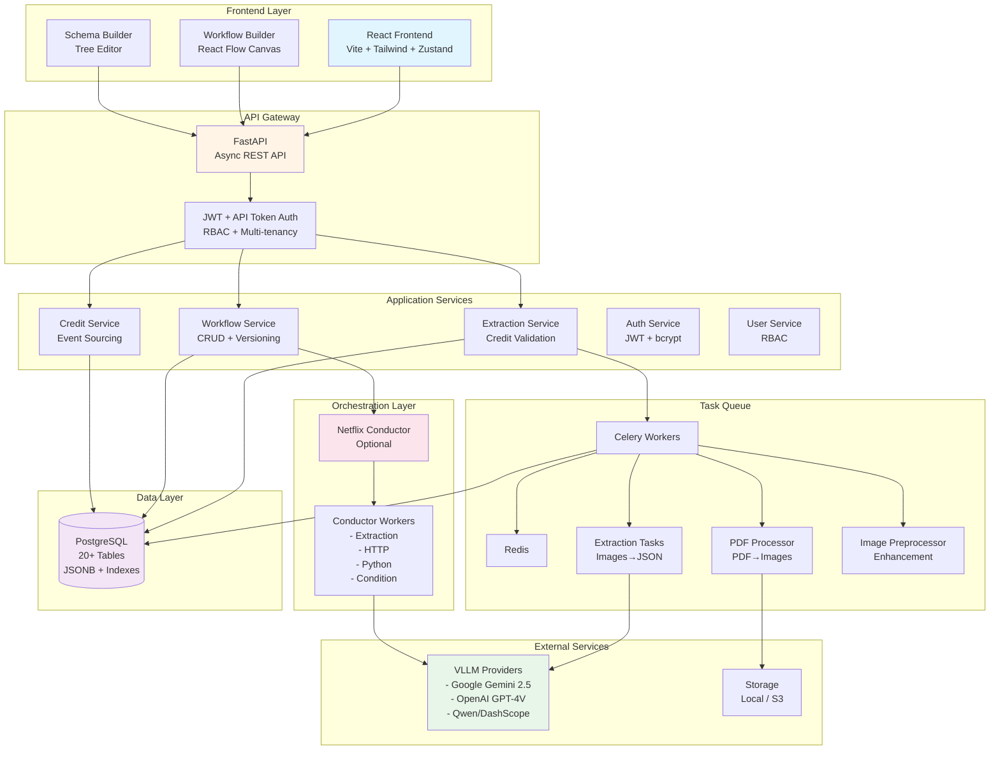
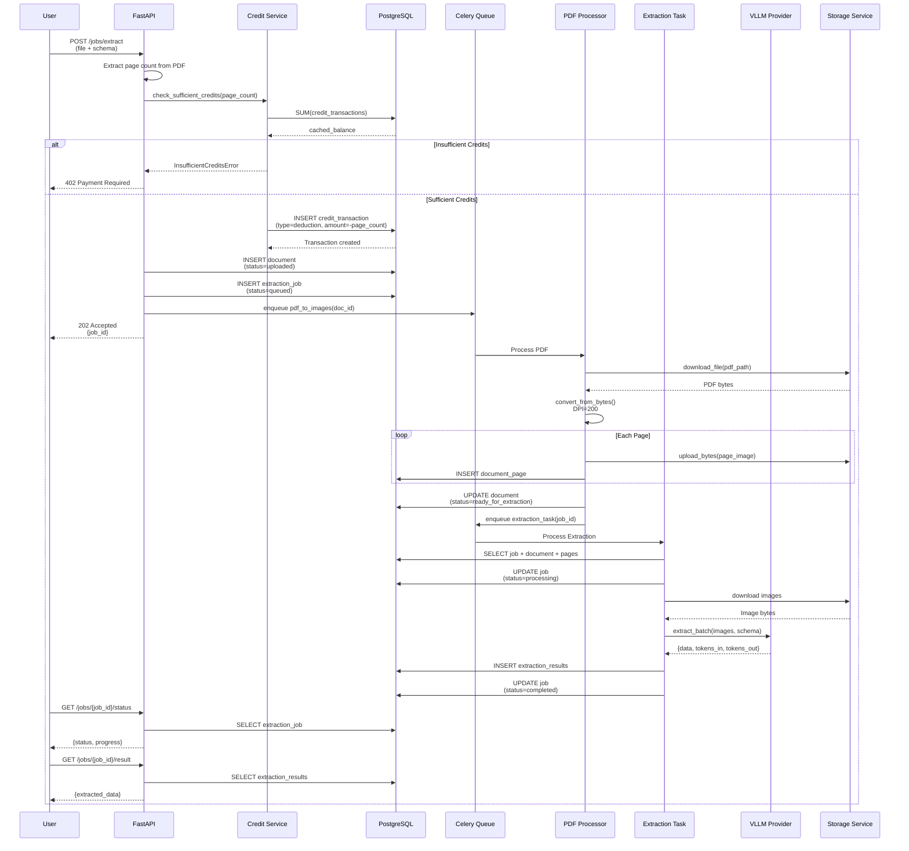
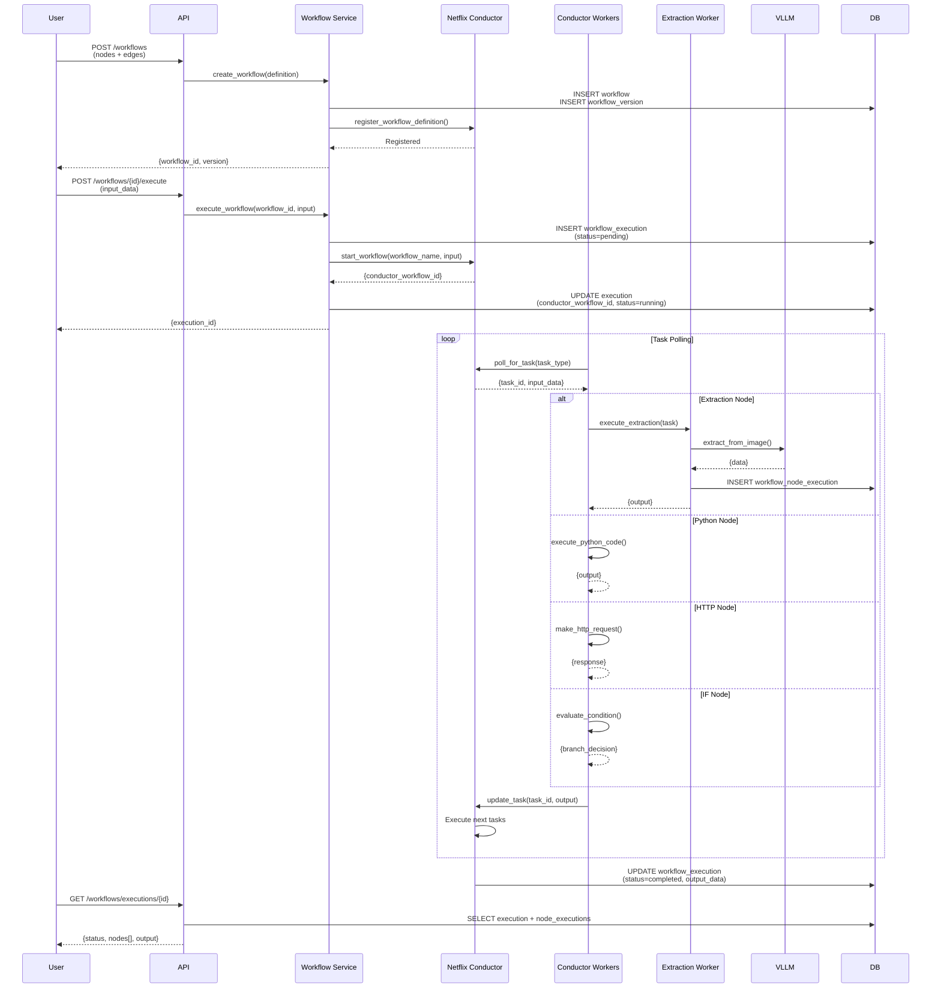
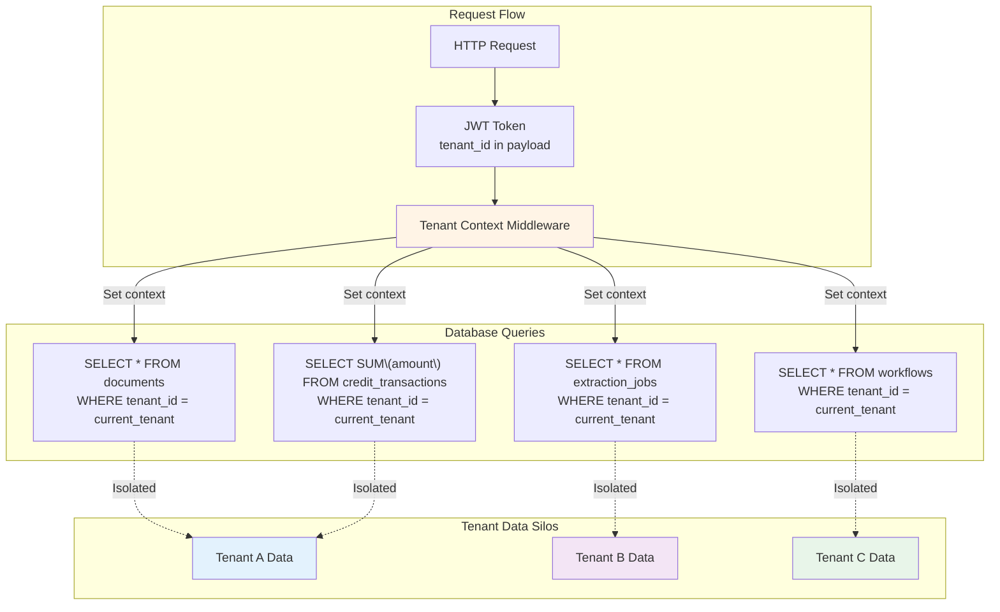
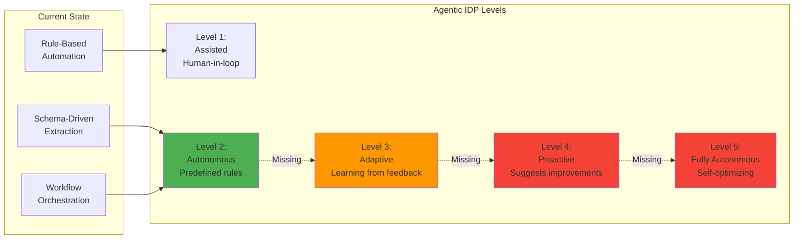
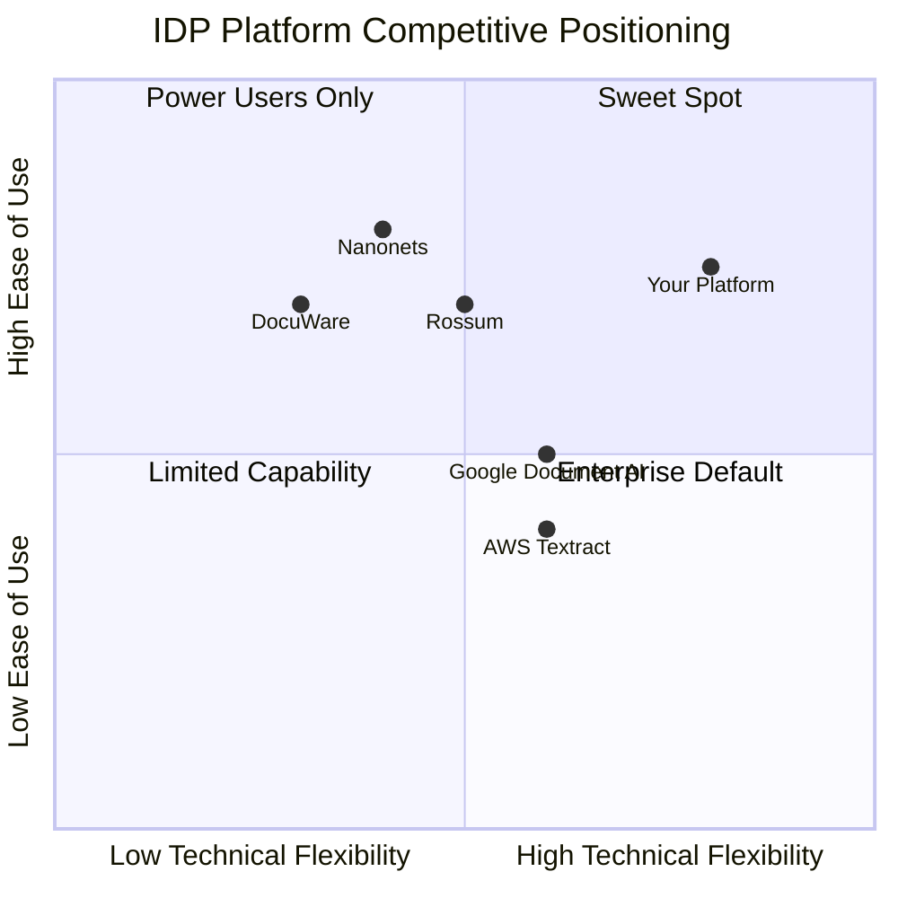
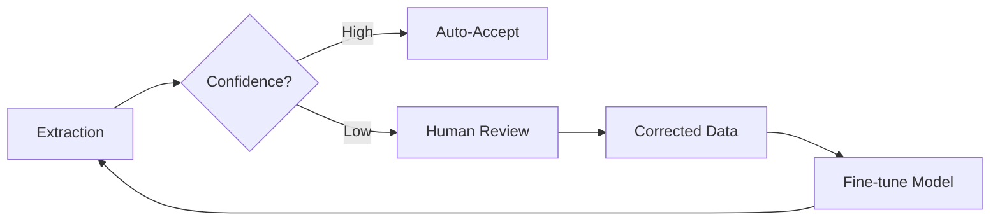
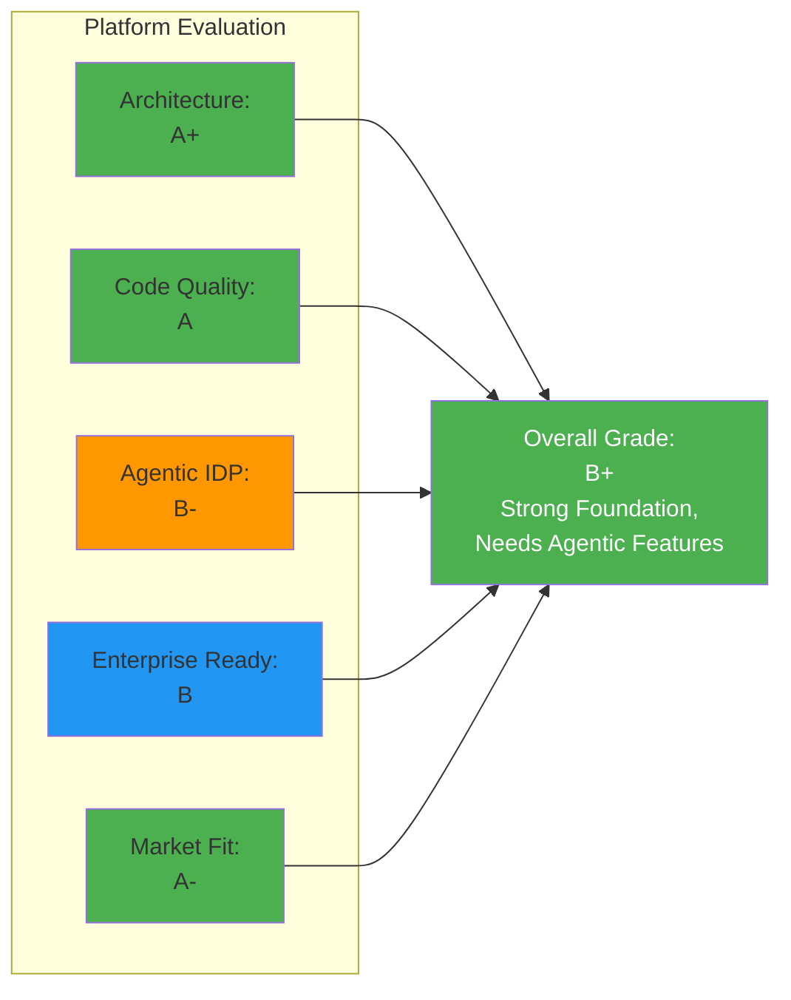
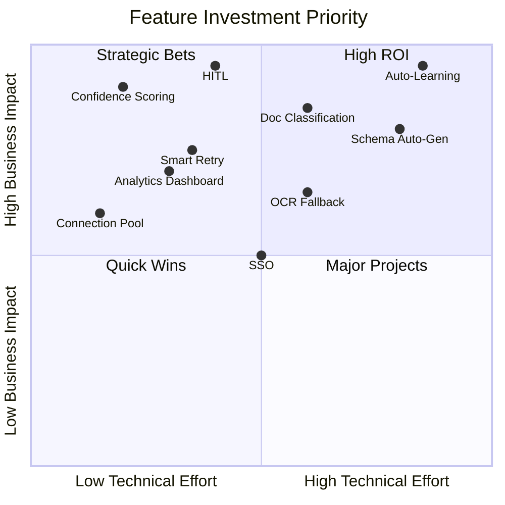

# Comprehensive Platform Analysis: AI Document Processing IDP

**Date:** 2025-12-02
**Type:** Strategic Platform Review
**Status:** Complete

---

## Executive Summary

Your platform is a **multi-tenant SaaS for AI-powered document processing** with a strong foundation in clean architecture, stateless job processing, and visual workflow orchestration. It demonstrates enterprise-grade patterns with SOLID principles, event sourcing for credits, and comprehensive multi-tenancy isolation.

**Overall Grade: B+ (Strong Foundation, Needs Intelligence Layer)**

**Market Position: Top 20% of IDP platforms (can reach Top 5% with agentic features)**

---

## 1. Architecture Diagrams

### 1.1 High-Level System Architecture



### 1.2 Document Processing Data Flow



### 1.3 Workflow Execution Flow



### 1.4 Credit System Architecture (Event Sourcing)

```mermaid
graph LR
    subgraph "Credit Events"
        E1[Deduction<br/>-page_count]
        E2[Topup<br/>+amount]
        E3[Refund<br/>+amount]
        E4[Admin Adjustment<br/>±amount]
        E5[Trial Signup<br/>+free_credits]
    end

    subgraph "Event Store"
        CT[(credit_transactions<br/>Immutable Log)]
    end

    subgraph "Balance Calculation"
        SUM[SUM\(amount\)]
        CACHE[Tenant.cached_balance<br/>O\(1\) Lookup]
    end

    subgraph "Validation"
        CHECK{Balance ≥ Cost?}
        DEDUCT[Create Deduction]
        REJECT[402 Error]
    end

    E1 --> CT
    E2 --> CT
    E3 --> CT
    E4 --> CT
    E5 --> CT

    CT --> SUM
    SUM --> CACHE

    CACHE --> CHECK
    CHECK -->|Yes| DEDUCT
    CHECK -->|No| REJECT
    DEDUCT --> CT

    style CT fill:#f3e5f5
    style CACHE fill:#e8f5e9
    style DEDUCT fill:#fff4e6
    style REJECT fill:#ffebee
```

### 1.5 Multi-Tenancy Data Isolation



---

## 2. Analysis as Agentic IDP Platform

### 2.1 Current Agentic Capabilities ✅

Your platform demonstrates **foundational agentic characteristics**:

| Capability | Implementation | Agentic Level |
|-----------|----------------|---------------|
| **Autonomous Processing** | Celery workers process documents without human intervention | ⭐⭐⭐⭐ Strong |
| **Self-Service Schema Creation** | Users create extraction schemas via visual builder | ⭐⭐⭐⭐ Strong |
| **Multi-Provider Intelligence** | Abstracts VLLM providers (Gemini, GPT-4V, Qwen) | ⭐⭐⭐⭐ Strong |
| **Workflow Orchestration** | Netflix Conductor + visual workflow builder (5 node types) | ⭐⭐⭐ Moderate |
| **Stateless Resilience** | Workers query current state, retry with backoff | ⭐⭐⭐⭐ Strong |
| **Event Sourcing** | Credit transactions as immutable event log | ⭐⭐⭐ Moderate |
| **Adaptive Processing** | 3 extraction modes (batch, per-page, markdown pipeline) | ⭐⭐⭐ Moderate |

### 2.2 Workflow Builder as Agentic Foundation

Your **Workflow Builder** is the most agentic component:

**Node Types (5 total):**
1. **HTTP Trigger** - Webhook entry point
2. **Extraction** - Document processing node
3. **Python Runner** - Custom code execution
4. **HTTP Request** - External API integration
5. **IF** - Conditional branching

**Agentic Features:**
- **Expression System:** `${workflow.input.field}` for dynamic data flow
- **Visual Programming:** No-code/low-code workflow creation
- **Versioning:** Change tracking for workflow iterations
- **Netflix Conductor Integration:** Distributed execution with fault tolerance

**Current Limitation:** Workflows are **static** (predefined by users), not **adaptive** (AI-driven decision-making)

### 2.3 Agentic IDP Maturity Assessment



**Current Maturity: Level 2 - Autonomous with Predefined Rules**

---

## 3. Critical Shortfalls & Missing Features

### 3.1 🔴 Critical Gaps for Agentic IDP

| Gap | Business Impact | Technical Complexity |
|-----|----------------|---------------------|
| **1. No Active Learning** | Can't improve accuracy over time | High |
| **2. No Human-in-the-Loop (HITL)** | No feedback mechanism for bad extractions | Medium |
| **3. No Confidence Scoring** | Can't auto-reject low-confidence results | Low |
| **4. No Schema Auto-Generation** | Users must manually create schemas | High |
| **5. No Document Classification** | Can't route documents to correct workflows | Medium |
| **6. No Smart Retry Logic** | Doesn't try different providers/prompts on failure | Medium |
| **7. No Analytics Dashboard** | Can't track accuracy/performance trends | Low |
| **8. No A/B Testing** | Can't compare providers/prompts systematically | Medium |

### 3.2 🟡 Moderate Gaps

| Gap | Description | Priority |
|-----|-------------|----------|
| **Batch API** | No bulk upload endpoint for enterprises | Medium |
| **Webhook Callbacks** | Limited callback support (only in `/jobs/extract`) | Medium |
| **Rate Limiting** | No tenant-level rate limiting | Medium |
| **Data Retention Policies** | No automatic cleanup of old documents | Low |
| **Multi-Language Support** | No i18n for extracted data | Low |
| **OCR Fallback** | No traditional OCR when VLLM fails | High |
| **Document Versioning** | Can't track document re-extractions | Low |
| **Extraction Comparison** | No side-by-side comparison of different runs | Medium |

### 3.3 🟢 Missing Enterprise Features

| Feature | Why It Matters | Implementation Effort |
|---------|----------------|---------------------|
| **SSO Integration** | Enterprise customers need SAML/OAuth2 | Medium |
| **Audit Logs** | Compliance requires full audit trail | Low (partial exists) |
| **Data Encryption at Rest** | Security compliance | Medium |
| **SLA Monitoring** | Track uptime/latency per tenant | Medium |
| **Cost Allocation** | Chargeback for internal teams | Low |
| **White-Label** | Reseller opportunities | High |
| **On-Premise Deployment** | Large enterprises require it | Very High |

---

## 4. Competitive Advantages 🚀

### 4.1 Strong Differentiators

| Advantage | Competitive Moat | Market Rarity |
|-----------|-----------------|---------------|
| **1. Visual Workflow Builder** | No-code IDP pipelines with 5 node types | ⭐⭐⭐⭐⭐ Very Rare |
| **2. Multi-Provider VLLM** | Abstract Gemini/GPT-4V/Qwen | ⭐⭐⭐⭐ Rare |
| **3. Schema-Driven Extraction** | User-defined JSON schemas | ⭐⭐⭐ Common |
| **4. Event-Sourced Credits** | Full audit trail with O(1) balance | ⭐⭐⭐⭐ Rare |
| **5. Three Extraction Modes** | Batch, per-page, markdown pipeline | ⭐⭐⭐ Common |
| **6. Netflix Conductor Integration** | Enterprise-grade orchestration | ⭐⭐⭐⭐ Rare |
| **7. Clean Architecture** | SOLID + DDD patterns | ⭐⭐⭐ Common |
| **8. Markdown Intermediate Format** | Two-stage pipeline for complex docs | ⭐⭐⭐⭐ Rare |

### 4.2 Technical Excellence

**What Sets You Apart:**

1. **Stateless Workers:** Can scale horizontally without state management complexity
2. **Type Safety:** Enums everywhere (no magic strings), Pydantic validation
3. **Two-Stage Pipeline:** PDF→Images (once) → Images→JSON (many times) enables experimentation
4. **Workflow Versioning:** Change tracking for compliance/auditing
5. **Expression System:** `${workflow.input.field}` enables dynamic workflows

### 4.3 Market Positioning



**Your Platform** is in the **Sweet Spot**: High flexibility + High ease of use

---

## 5. Strategic Recommendations

### 5.1 🎯 Short-Term (Next 30 days)

**Priority 1: Add Confidence Scoring**
```python
# In ExtractionResult model
confidence_score = Column(Float, nullable=True)  # Already exists!

# Add auto-rejection logic
if confidence_score < 0.7:
    status = "needs_review"  # Flag for human review
```

**Priority 2: Implement HITL (Human-in-the-Loop)**
```python
# New endpoints:
POST /api/v1/jobs/{job_id}/review  # Submit corrected data
GET /api/v1/jobs/needs_review      # List low-confidence jobs
```

**Priority 3: Add Extraction Comparison**
- Side-by-side view of different extraction runs
- Diff highlighting for changed fields
- Provider performance comparison

### 5.2 🚀 Medium-Term (Next 90 days)

**Priority 1: Auto-Schema Generation**


**Priority 2: Document Classification**
```python
# New model:
class DocumentClassifier:
    async def classify(document_image) -> str:
        # Returns: "invoice", "receipt", "contract", etc.
        pass

# Auto-route to workflows:
if doc_type == "invoice":
    workflow_id = tenant.default_invoice_workflow
```

**Priority 3: Smart Retry Logic**
```python
# Fallback chain:
1. Try default provider (Gemini)
2. If confidence < 0.7, try GPT-4V
3. If still low, try Qwen
4. If all fail, flag for human review
```

### 5.3 🌟 Long-Term (Next 6-12 months)

**Priority 1: Active Learning Loop**


**Priority 2: Agentic Workflow Builder**
- **AI-Suggested Workflows:** Analyze extraction patterns → suggest workflows
- **Self-Optimizing Nodes:** Auto-tune prompts based on success rates
- **Anomaly Detection:** Flag unusual extractions for review

**Priority 3: Multi-Modal Intelligence**
- **OCR Fallback:** Use Tesseract/EasyOCR when VLLM fails
- **Table Extraction:** Dedicated table understanding
- **Handwriting Recognition:** Process handwritten forms
- **Signature Detection:** Validate signed documents

---

## 6. Benchmark Against Leading IDP Platforms

| Feature | Your Platform | Nanonets | Rossum | AWS Textract | Google Doc AI |
|---------|--------------|----------|--------|--------------|---------------|
| **Visual Workflow Builder** | ✅ 5 node types | ❌ | ✅ Limited | ❌ | ❌ |
| **Multi-Provider VLLM** | ✅ 3 providers | ❌ Proprietary | ❌ Proprietary | ❌ AWS only | ❌ Google only |
| **Custom Schemas** | ✅ JSON Schema | ✅ UI-based | ✅ UI-based | ❌ Predefined | ⚠️ Limited |
| **HITL** | ❌ **Missing** | ✅ | ✅ | ⚠️ External | ⚠️ External |
| **Auto-Learning** | ❌ **Missing** | ✅ | ✅ | ❌ | ❌ |
| **Document Classification** | ❌ **Missing** | ✅ | ✅ | ✅ | ✅ |
| **Confidence Scoring** | ⚠️ Exists but unused | ✅ | ✅ | ✅ | ✅ |
| **Audit Trail** | ✅ Event sourcing | ✅ | ✅ | ⚠️ CloudTrail | ⚠️ Logging |
| **Pricing Transparency** | ✅ Credit-based | ⚠️ Complex | ⚠️ Enterprise | ⚠️ Pay-per-use | ⚠️ Pay-per-use |
| **Self-Hostable** | ✅ Docker | ❌ | ❌ | ❌ | ❌ |
| **API-First** | ✅ OpenAPI | ✅ | ✅ | ✅ | ✅ |

**Your Strongest Advantages:**
1. ✅ **Visual Workflow Builder** - Unique capability
2. ✅ **Multi-Provider** - Not vendor-locked
3. ✅ **Self-Hostable** - Enterprise advantage
4. ✅ **Clean Architecture** - Developer-friendly

**Your Biggest Gaps:**
1. ❌ **HITL** - Critical for enterprise adoption
2. ❌ **Auto-Learning** - Needed for competitive accuracy
3. ❌ **Document Classification** - Table stakes feature

---

## 7. Technical Debt & Code Quality

### 7.1 ✅ Excellent Practices

1. **Enum-based constants** - No magic strings (`app/models/enums.py`)
2. **SOLID principles** - Clean service layer
3. **Event sourcing** - Immutable credit transactions
4. **Type safety** - Pydantic + TypeScript strict
5. **Debugging journals** - Knowledge capture in `debugging_journals/`
6. **Centralized API wrapper** - Consistent auth handling

### 7.2 ⚠️ Technical Debt

| Issue | Location | Impact | Priority |
|-------|----------|--------|----------|
| **Confidence score unused** | `ExtractionResult.confidence_score` exists but not populated | High | High |
| **Markdown pipeline incomplete** | `DocumentPage.markdown_content` exists but no HITL | Medium | Medium |
| **Conductor optional** | Workflow orchestration not required | Low | Low |
| **No caching** | Every credit balance recalculated | Medium | Medium |
| **No connection pooling** | DB connections not pooled in workers | High | High |
| **Frontend API wrapper duplication** | `apiFetch()` duplicated across services | Medium | Medium |

### 7.3 🔧 Quick Wins

1. **Enable confidence scoring** (1 day)
   - Populate `confidence_score` in VLLM providers
   - Add threshold-based auto-rejection

2. **Implement connection pooling** (2 days)
   - Use SQLAlchemy pool with QueuePool
   - Configure `pool_size`, `max_overflow`

3. **Cache credit balance** (1 day)
   - Already exists (`Tenant.cached_balance`)
   - Ensure it's updated on every transaction

4. **Extract frontend API wrapper** (1 day)
   - Create shared `lib/api-client.ts`
   - Remove duplicated `apiFetch()` functions

---

## 8. Final Assessment & Action Plan

### 8.1 Overall Platform Grade



### 8.2 30-60-90 Day Action Plan

#### **Week 1-2: Quick Wins**
1. ✅ **Enable Confidence Scoring**
   - Populate `ExtractionResult.confidence_score`
   - Add auto-rejection for confidence < 0.7
   - **Files:** `app/services/vllm_service.py`, `app/tasks/*.py`

2. ✅ **Implement Connection Pooling**
   - Configure SQLAlchemy `QueuePool`
   - Test under load with 50+ concurrent workers
   - **Files:** `app/database.py`, `app/db/session.py`

3. ✅ **Add Extraction Comparison UI**
   - Side-by-side view of different runs
   - Highlight differences between providers
   - **Files:** `frontend/src/pages/jobs/JobResults.tsx`

#### **Week 3-4: HITL Foundation**
4. ✅ **Build Human-in-the-Loop System**
   ```
   POST /api/v1/jobs/{job_id}/review
   GET /api/v1/jobs/needs_review
   PATCH /api/v1/jobs/{job_id}/corrections
   ```
   - **Files:** `app/api/jobs.py`, `app/models/extraction_correction.py`

5. ✅ **Add Correction Tracking**
   - New table: `extraction_corrections`
   - Store human feedback for future learning
   - **Migration:** Create new Alembic migration

#### **Week 5-8: Document Intelligence**
6. ✅ **Implement Document Classification**
   - Use VLLM to classify document types
   - Auto-route to appropriate workflows
   - **Files:** `app/services/document_classifier.py`, `app/api/documents.py`

7. ✅ **Add Smart Retry Logic**
   - Fallback chain: Gemini → GPT-4V → Qwen
   - Track which provider works best per doc type
   - **Files:** `app/tasks/extraction_tasks.py`, `app/services/extraction_service.py`

#### **Week 9-12: Analytics & Optimization**
8. ✅ **Build Analytics Dashboard**
   - Accuracy trends over time
   - Provider performance comparison
   - Cost per document type
   - **Files:** `app/api/analytics.py`, `frontend/src/pages/Analytics.tsx`

9. ✅ **Implement A/B Testing**
   - Compare prompts/providers systematically
   - Auto-select best-performing configuration
   - **Files:** `app/services/ab_testing_service.py`

### 8.3 Investment Priority Matrix



### 8.4 Critical Success Factors

To evolve from **Level 2 (Autonomous)** to **Level 3+ (Adaptive Agentic IDP)**:

| Success Factor | Current State | Target State | Timeline |
|----------------|---------------|--------------|----------|
| **1. Feedback Loop** | ❌ No HITL | ✅ Human corrections tracked | 30 days |
| **2. Confidence Scoring** | ⚠️ Exists but unused | ✅ Auto-reject low confidence | 7 days |
| **3. Active Learning** | ❌ No learning | ✅ Model fine-tuning from corrections | 90 days |
| **4. Smart Routing** | ❌ Manual workflows | ✅ Auto-classify and route | 60 days |
| **5. Self-Optimization** | ❌ Static configs | ✅ A/B testing providers/prompts | 90 days |

---

## 9. Summary

### Your Platform's DNA

**Strengths (Architectural Excellence):**
- 🏆 **Visual Workflow Builder** - Market differentiator
- 🏆 **Multi-Provider Abstraction** - Avoid vendor lock-in
- 🏆 **Clean Architecture** - SOLID + DDD patterns
- 🏆 **Event Sourcing Credits** - Full audit trail
- 🏆 **Stateless Workers** - Horizontal scaling ready

**Critical Gaps (Agentic Intelligence):**
- ⚠️ **No Human-in-the-Loop** - Can't learn from corrections
- ⚠️ **No Document Classification** - Manual workflow selection
- ⚠️ **Confidence Score Unused** - Can't auto-reject bad results
- ⚠️ **No Active Learning** - Doesn't improve over time

### One-Line Summary

> **"You have an A+ foundation for an agentic IDP platform, but need to add intelligence layers (HITL, classification, active learning) to reach Level 3+ agentic maturity."**

### The Path Forward

**Your competitive moat is the Visual Workflow Builder + Multi-Provider abstraction.**

**Your immediate opportunity is adding intelligence:**
1. **Week 1:** Enable confidence scoring → auto-reject bad results
2. **Week 2-4:** Build HITL → capture human corrections
3. **Week 5-8:** Add document classification → auto-routing
4. **Week 9-12:** Implement active learning → self-improvement

**Do this, and you'll have a truly agentic IDP platform that enterprises will pay premium prices for.**

---

## Related Documentation

- [Stateless Job Processing Architecture](../architecture/2025-11-02-stateless-job-processing.md)
- [VLLM Integration Guide](../architecture/2025-11-02-vllm-integration.md)
- [Workflow Builder Architecture](../architecture/2025-11-15-workflow-builder-architecture.md)
- [JWT Authentication & Multi-Tenancy](../architecture/2025-11-03-jwt-authentication-and-multi-tenancy.md)

---

**Report Generated:** 2025-12-02
**Next Review:** 2026-01-02 (30 days)
**Version:** 1.0